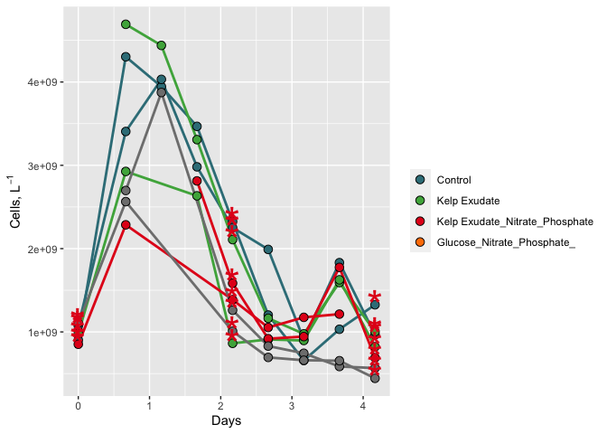
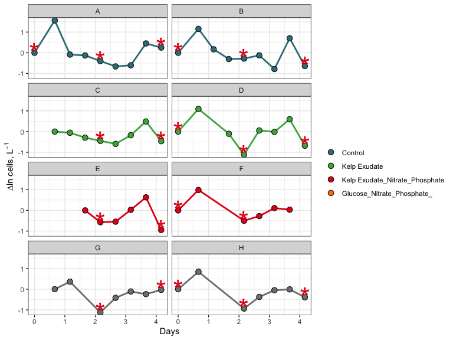

144L_Abundance_2021_Data
================
Gabrielle Mousseau
10/18/2021

#Goal This document sows how individual bottle bacterial abundance from
2021 remineralization experiments were processed, QC’d, and analyzed.
Info on how to code and notes are also included.

#Intro to R Markdown To create a new code chunk: Cmd + option + i. Load
packages needed to analyze the data. Using settings, we can toggle
on/off warnings that we dont want in our final rmd.

#Import Data Attach data and join datasets usings variables that are the
same across two dataframes

``` r
excel_sheets("~/144l_students_2021/Input_Data/week4/144L_2021_BactAbund.xlsx")
```

    ## [1] "Metadata" "Data"

``` r
metadata <- read_excel("~/144l_students_2021/Input_Data/week4/144L_2021_BactAbund.xlsx", sheet = "Metadata")

glimpse(metadata)
```

    ## Rows: 80
    ## Columns: 16
    ## $ Experiment           <chr> "144L_2021", "144L_2021", "144L_2021", "144L_2021…
    ## $ Location             <chr> "Goleta Pier", "Goleta Pier", "Goleta Pier", "Gol…
    ## $ Temperature          <dbl> 19, 19, 19, 19, 19, 19, 19, 19, 19, 19, 19, 19, 1…
    ## $ Depth                <dbl> 1, 1, 1, 1, 1, 1, 1, 1, 1, 1, 1, 1, 1, 1, 1, 1, 1…
    ## $ Bottle               <chr> "A", "A", "A", "A", "A", "A", "A", "A", "A", "A",…
    ## $ Timepoint            <dbl> 0, 1, 2, 3, 4, 5, 6, 7, 8, 9, 0, 1, 2, 3, 4, 5, 6…
    ## $ Treatment            <chr> "Control", "Control", "Control", "Control", "Cont…
    ## $ Target_DOC_Amendment <dbl> 0, 0, 0, 0, 0, 0, 0, 0, 0, 0, 0, 0, 0, 0, 0, 0, 0…
    ## $ Inoculum_L           <dbl> 2, 2, 2, 2, 2, 2, 2, 2, 2, 2, 2, 2, 2, 2, 2, 2, 2…
    ## $ Media_L              <dbl> 5, 5, 5, 5, 5, 5, 5, 5, 5, 5, 5, 5, 5, 5, 5, 5, 5…
    ## $ Datetime             <chr> "2021-10-04T16:00", "2021-10-05T08:00", "2021-10-…
    ## $ TOC_Sample           <lgl> TRUE, FALSE, FALSE, FALSE, TRUE, FALSE, FALSE, FA…
    ## $ Cell_Sample          <lgl> TRUE, TRUE, TRUE, TRUE, TRUE, TRUE, TRUE, TRUE, T…
    ## $ DAPI_Sample          <lgl> TRUE, FALSE, FALSE, FALSE, TRUE, FALSE, FALSE, FA…
    ## $ DNA_Sample           <lgl> TRUE, FALSE, FALSE, FALSE, TRUE, FALSE, FALSE, FA…
    ## $ Nutrient_Sample      <lgl> TRUE, FALSE, FALSE, FALSE, FALSE, FALSE, FALSE, F…

``` r
#unique(metadata$Bottle)
#unique(metadata$Treatment)

data <- read_excel("~/144l_students_2021/Input_Data/week4/144L_2021_BactAbund.xlsx", sheet = "Data")
glimpse(data)
```

    ## Rows: 72
    ## Columns: 5
    ## $ Bottle       <chr> "A", "A", "A", "A", "A", "A", "A", "A", "A", "B", "B", "B…
    ## $ Timepoint    <dbl> 0, 1, 2, 3, 4, 5, 6, 7, 8, 0, 1, 2, 3, 4, 5, 6, 7, 8, 0, …
    ## $ all_cells_uL <chr> "901.48904752420799", "4302.9300548457404", "3944.9457004…
    ## $ LNA_cells_uL <chr> "653.047184033284", "768.27893058466896", "937.2441189022…
    ## $ HNA_cells_uL <chr> "248.441863490923", "3534.65112426107", "3007.70158156820…

``` r
joined <- left_join(metadata, data) #attach data to metadata
```

    ## Joining, by = c("Bottle", "Timepoint")

``` r
glimpse(joined)
```

    ## Rows: 80
    ## Columns: 19
    ## $ Experiment           <chr> "144L_2021", "144L_2021", "144L_2021", "144L_2021…
    ## $ Location             <chr> "Goleta Pier", "Goleta Pier", "Goleta Pier", "Gol…
    ## $ Temperature          <dbl> 19, 19, 19, 19, 19, 19, 19, 19, 19, 19, 19, 19, 1…
    ## $ Depth                <dbl> 1, 1, 1, 1, 1, 1, 1, 1, 1, 1, 1, 1, 1, 1, 1, 1, 1…
    ## $ Bottle               <chr> "A", "A", "A", "A", "A", "A", "A", "A", "A", "A",…
    ## $ Timepoint            <dbl> 0, 1, 2, 3, 4, 5, 6, 7, 8, 9, 0, 1, 2, 3, 4, 5, 6…
    ## $ Treatment            <chr> "Control", "Control", "Control", "Control", "Cont…
    ## $ Target_DOC_Amendment <dbl> 0, 0, 0, 0, 0, 0, 0, 0, 0, 0, 0, 0, 0, 0, 0, 0, 0…
    ## $ Inoculum_L           <dbl> 2, 2, 2, 2, 2, 2, 2, 2, 2, 2, 2, 2, 2, 2, 2, 2, 2…
    ## $ Media_L              <dbl> 5, 5, 5, 5, 5, 5, 5, 5, 5, 5, 5, 5, 5, 5, 5, 5, 5…
    ## $ Datetime             <chr> "2021-10-04T16:00", "2021-10-05T08:00", "2021-10-…
    ## $ TOC_Sample           <lgl> TRUE, FALSE, FALSE, FALSE, TRUE, FALSE, FALSE, FA…
    ## $ Cell_Sample          <lgl> TRUE, TRUE, TRUE, TRUE, TRUE, TRUE, TRUE, TRUE, T…
    ## $ DAPI_Sample          <lgl> TRUE, FALSE, FALSE, FALSE, TRUE, FALSE, FALSE, FA…
    ## $ DNA_Sample           <lgl> TRUE, FALSE, FALSE, FALSE, TRUE, FALSE, FALSE, FA…
    ## $ Nutrient_Sample      <lgl> TRUE, FALSE, FALSE, FALSE, FALSE, FALSE, FALSE, F…
    ## $ all_cells_uL         <chr> "901.48904752420799", "4302.9300548457404", "3944…
    ## $ LNA_cells_uL         <chr> "653.047184033284", "768.27893058466896", "937.24…
    ## $ HNA_cells_uL         <chr> "248.441863490923", "3534.65112426107", "3007.701…

#Prepare Data We convert categorical data (date and time) to numeric,
add columns with time elapsed for each treatment, and concert cells_uL
to cells_L to help with TOC data later. We will also subset data for
variables of interest and drop NA values.

We will utilize **piping**. Piping allows you to five multiple commands.
%>% means “first do this. THEN, do this” Then = %>% giving order to the
commands.

``` r
cells <- joined %>% 
  mutate(Datetime = ymd_hm(Datetime),#splits apart Datetime as specified
  cells_L = as.numeric(all_cells_uL) * 1000000) %>% 
  group_by(Treatment, Bottle) %>% 
  #group datasets so we can time elpase properly
  mutate(interv = interval(first(Datetime), Datetime), 
  s = as.numeric(interv), 
  hours = s/3600, 
  days = hours/24) %>% 
  ungroup() %>% 
  select(Experiment:DNA_Sample, cells_L, hours, days) %>%
  drop_na(cells_L)
  
glimpse(cells)
```

    ## Rows: 60
    ## Columns: 18
    ## $ Experiment           <chr> "144L_2021", "144L_2021", "144L_2021", "144L_2021…
    ## $ Location             <chr> "Goleta Pier", "Goleta Pier", "Goleta Pier", "Gol…
    ## $ Temperature          <dbl> 19, 19, 19, 19, 19, 19, 19, 19, 19, 19, 19, 19, 1…
    ## $ Depth                <dbl> 1, 1, 1, 1, 1, 1, 1, 1, 1, 1, 1, 1, 1, 1, 1, 1, 1…
    ## $ Bottle               <chr> "A", "A", "A", "A", "A", "A", "A", "A", "A", "B",…
    ## $ Timepoint            <dbl> 0, 1, 2, 3, 4, 5, 6, 7, 8, 0, 1, 2, 3, 4, 5, 6, 7…
    ## $ Treatment            <chr> "Control", "Control", "Control", "Control", "Cont…
    ## $ Target_DOC_Amendment <dbl> 0, 0, 0, 0, 0, 0, 0, 0, 0, 0, 0, 0, 0, 0, 0, 0, 0…
    ## $ Inoculum_L           <dbl> 2, 2, 2, 2, 2, 2, 2, 2, 2, 2, 2, 2, 2, 2, 2, 2, 2…
    ## $ Media_L              <dbl> 5, 5, 5, 5, 5, 5, 5, 5, 5, 5, 5, 5, 5, 5, 5, 5, 5…
    ## $ Datetime             <dttm> 2021-10-04 16:00:00, 2021-10-05 08:00:00, 2021-1…
    ## $ TOC_Sample           <lgl> TRUE, FALSE, FALSE, FALSE, TRUE, FALSE, FALSE, FA…
    ## $ Cell_Sample          <lgl> TRUE, TRUE, TRUE, TRUE, TRUE, TRUE, TRUE, TRUE, T…
    ## $ DAPI_Sample          <lgl> TRUE, FALSE, FALSE, FALSE, TRUE, FALSE, FALSE, FA…
    ## $ DNA_Sample           <lgl> TRUE, FALSE, FALSE, FALSE, TRUE, FALSE, FALSE, FA…
    ## $ cells_L              <dbl> 901489048, 4302930055, 3944945700, 3467546844, 23…
    ## $ hours                <dbl> 0, 16, 28, 40, 52, 64, 76, 88, 100, 0, 16, 28, 40…
    ## $ days                 <dbl> 0.0000000, 0.6666667, 1.1666667, 1.6666667, 2.166…

``` r
#View(cells)
```

#Plot Growth Curve

``` r
custom.colors <- c("Control" = "#377E88", "Kelp Exudate" = "#4DAF4A", "Kelp Exudate_Nitrate_Phosphate" = "#E41A1C", "Glucose_Nitrate_Phosphate_" = "#FF7F00")

levels <- c("Control", "Kelp Exudate", "Kelp Exudate_Nitrate_Phosphate", "Glucose_Nitrate_Phosphate")

cells %>% 
  mutate(dna = ifelse(DNA_Sample == T, "*", NA)) %>%
  ggplot(aes(x=days, y = cells_L, group = interaction(Treatment, Bottle))) + 
  geom_line(aes(color = factor(Treatment, levels= levels)), size =1) +
  geom_point(aes(fill = factor(Treatment, levels = levels)),
  size = 3, color = "black", shape = 21) +
  geom_text(aes(label = dna), size = 12, color = "#E41A1C") +
  labs(x = "Days", y = expression(paste("Cells, L"^-1)), fill = "") +
  guides(color = "none") + 
  scale_color_manual(values = custom.colors) + 
  scale_fill_manual(values = custom.colors)
```

    ## Warning: Removed 40 rows containing missing values (geom_text).

<!-- -->

``` r
  #facet_grid(rows = "Treatment")
  theme_bw()
```

    ## List of 93
    ##  $ line                      :List of 6
    ##   ..$ colour       : chr "black"
    ##   ..$ size         : num 0.5
    ##   ..$ linetype     : num 1
    ##   ..$ lineend      : chr "butt"
    ##   ..$ arrow        : logi FALSE
    ##   ..$ inherit.blank: logi TRUE
    ##   ..- attr(*, "class")= chr [1:2] "element_line" "element"
    ##  $ rect                      :List of 5
    ##   ..$ fill         : chr "white"
    ##   ..$ colour       : chr "black"
    ##   ..$ size         : num 0.5
    ##   ..$ linetype     : num 1
    ##   ..$ inherit.blank: logi TRUE
    ##   ..- attr(*, "class")= chr [1:2] "element_rect" "element"
    ##  $ text                      :List of 11
    ##   ..$ family       : chr ""
    ##   ..$ face         : chr "plain"
    ##   ..$ colour       : chr "black"
    ##   ..$ size         : num 11
    ##   ..$ hjust        : num 0.5
    ##   ..$ vjust        : num 0.5
    ##   ..$ angle        : num 0
    ##   ..$ lineheight   : num 0.9
    ##   ..$ margin       : 'margin' num [1:4] 0points 0points 0points 0points
    ##   .. ..- attr(*, "unit")= int 8
    ##   ..$ debug        : logi FALSE
    ##   ..$ inherit.blank: logi TRUE
    ##   ..- attr(*, "class")= chr [1:2] "element_text" "element"
    ##  $ title                     : NULL
    ##  $ aspect.ratio              : NULL
    ##  $ axis.title                : NULL
    ##  $ axis.title.x              :List of 11
    ##   ..$ family       : NULL
    ##   ..$ face         : NULL
    ##   ..$ colour       : NULL
    ##   ..$ size         : NULL
    ##   ..$ hjust        : NULL
    ##   ..$ vjust        : num 1
    ##   ..$ angle        : NULL
    ##   ..$ lineheight   : NULL
    ##   ..$ margin       : 'margin' num [1:4] 2.75points 0points 0points 0points
    ##   .. ..- attr(*, "unit")= int 8
    ##   ..$ debug        : NULL
    ##   ..$ inherit.blank: logi TRUE
    ##   ..- attr(*, "class")= chr [1:2] "element_text" "element"
    ##  $ axis.title.x.top          :List of 11
    ##   ..$ family       : NULL
    ##   ..$ face         : NULL
    ##   ..$ colour       : NULL
    ##   ..$ size         : NULL
    ##   ..$ hjust        : NULL
    ##   ..$ vjust        : num 0
    ##   ..$ angle        : NULL
    ##   ..$ lineheight   : NULL
    ##   ..$ margin       : 'margin' num [1:4] 0points 0points 2.75points 0points
    ##   .. ..- attr(*, "unit")= int 8
    ##   ..$ debug        : NULL
    ##   ..$ inherit.blank: logi TRUE
    ##   ..- attr(*, "class")= chr [1:2] "element_text" "element"
    ##  $ axis.title.x.bottom       : NULL
    ##  $ axis.title.y              :List of 11
    ##   ..$ family       : NULL
    ##   ..$ face         : NULL
    ##   ..$ colour       : NULL
    ##   ..$ size         : NULL
    ##   ..$ hjust        : NULL
    ##   ..$ vjust        : num 1
    ##   ..$ angle        : num 90
    ##   ..$ lineheight   : NULL
    ##   ..$ margin       : 'margin' num [1:4] 0points 2.75points 0points 0points
    ##   .. ..- attr(*, "unit")= int 8
    ##   ..$ debug        : NULL
    ##   ..$ inherit.blank: logi TRUE
    ##   ..- attr(*, "class")= chr [1:2] "element_text" "element"
    ##  $ axis.title.y.left         : NULL
    ##  $ axis.title.y.right        :List of 11
    ##   ..$ family       : NULL
    ##   ..$ face         : NULL
    ##   ..$ colour       : NULL
    ##   ..$ size         : NULL
    ##   ..$ hjust        : NULL
    ##   ..$ vjust        : num 0
    ##   ..$ angle        : num -90
    ##   ..$ lineheight   : NULL
    ##   ..$ margin       : 'margin' num [1:4] 0points 0points 0points 2.75points
    ##   .. ..- attr(*, "unit")= int 8
    ##   ..$ debug        : NULL
    ##   ..$ inherit.blank: logi TRUE
    ##   ..- attr(*, "class")= chr [1:2] "element_text" "element"
    ##  $ axis.text                 :List of 11
    ##   ..$ family       : NULL
    ##   ..$ face         : NULL
    ##   ..$ colour       : chr "grey30"
    ##   ..$ size         : 'rel' num 0.8
    ##   ..$ hjust        : NULL
    ##   ..$ vjust        : NULL
    ##   ..$ angle        : NULL
    ##   ..$ lineheight   : NULL
    ##   ..$ margin       : NULL
    ##   ..$ debug        : NULL
    ##   ..$ inherit.blank: logi TRUE
    ##   ..- attr(*, "class")= chr [1:2] "element_text" "element"
    ##  $ axis.text.x               :List of 11
    ##   ..$ family       : NULL
    ##   ..$ face         : NULL
    ##   ..$ colour       : NULL
    ##   ..$ size         : NULL
    ##   ..$ hjust        : NULL
    ##   ..$ vjust        : num 1
    ##   ..$ angle        : NULL
    ##   ..$ lineheight   : NULL
    ##   ..$ margin       : 'margin' num [1:4] 2.2points 0points 0points 0points
    ##   .. ..- attr(*, "unit")= int 8
    ##   ..$ debug        : NULL
    ##   ..$ inherit.blank: logi TRUE
    ##   ..- attr(*, "class")= chr [1:2] "element_text" "element"
    ##  $ axis.text.x.top           :List of 11
    ##   ..$ family       : NULL
    ##   ..$ face         : NULL
    ##   ..$ colour       : NULL
    ##   ..$ size         : NULL
    ##   ..$ hjust        : NULL
    ##   ..$ vjust        : num 0
    ##   ..$ angle        : NULL
    ##   ..$ lineheight   : NULL
    ##   ..$ margin       : 'margin' num [1:4] 0points 0points 2.2points 0points
    ##   .. ..- attr(*, "unit")= int 8
    ##   ..$ debug        : NULL
    ##   ..$ inherit.blank: logi TRUE
    ##   ..- attr(*, "class")= chr [1:2] "element_text" "element"
    ##  $ axis.text.x.bottom        : NULL
    ##  $ axis.text.y               :List of 11
    ##   ..$ family       : NULL
    ##   ..$ face         : NULL
    ##   ..$ colour       : NULL
    ##   ..$ size         : NULL
    ##   ..$ hjust        : num 1
    ##   ..$ vjust        : NULL
    ##   ..$ angle        : NULL
    ##   ..$ lineheight   : NULL
    ##   ..$ margin       : 'margin' num [1:4] 0points 2.2points 0points 0points
    ##   .. ..- attr(*, "unit")= int 8
    ##   ..$ debug        : NULL
    ##   ..$ inherit.blank: logi TRUE
    ##   ..- attr(*, "class")= chr [1:2] "element_text" "element"
    ##  $ axis.text.y.left          : NULL
    ##  $ axis.text.y.right         :List of 11
    ##   ..$ family       : NULL
    ##   ..$ face         : NULL
    ##   ..$ colour       : NULL
    ##   ..$ size         : NULL
    ##   ..$ hjust        : num 0
    ##   ..$ vjust        : NULL
    ##   ..$ angle        : NULL
    ##   ..$ lineheight   : NULL
    ##   ..$ margin       : 'margin' num [1:4] 0points 0points 0points 2.2points
    ##   .. ..- attr(*, "unit")= int 8
    ##   ..$ debug        : NULL
    ##   ..$ inherit.blank: logi TRUE
    ##   ..- attr(*, "class")= chr [1:2] "element_text" "element"
    ##  $ axis.ticks                :List of 6
    ##   ..$ colour       : chr "grey20"
    ##   ..$ size         : NULL
    ##   ..$ linetype     : NULL
    ##   ..$ lineend      : NULL
    ##   ..$ arrow        : logi FALSE
    ##   ..$ inherit.blank: logi TRUE
    ##   ..- attr(*, "class")= chr [1:2] "element_line" "element"
    ##  $ axis.ticks.x              : NULL
    ##  $ axis.ticks.x.top          : NULL
    ##  $ axis.ticks.x.bottom       : NULL
    ##  $ axis.ticks.y              : NULL
    ##  $ axis.ticks.y.left         : NULL
    ##  $ axis.ticks.y.right        : NULL
    ##  $ axis.ticks.length         : 'simpleUnit' num 2.75points
    ##   ..- attr(*, "unit")= int 8
    ##  $ axis.ticks.length.x       : NULL
    ##  $ axis.ticks.length.x.top   : NULL
    ##  $ axis.ticks.length.x.bottom: NULL
    ##  $ axis.ticks.length.y       : NULL
    ##  $ axis.ticks.length.y.left  : NULL
    ##  $ axis.ticks.length.y.right : NULL
    ##  $ axis.line                 : list()
    ##   ..- attr(*, "class")= chr [1:2] "element_blank" "element"
    ##  $ axis.line.x               : NULL
    ##  $ axis.line.x.top           : NULL
    ##  $ axis.line.x.bottom        : NULL
    ##  $ axis.line.y               : NULL
    ##  $ axis.line.y.left          : NULL
    ##  $ axis.line.y.right         : NULL
    ##  $ legend.background         :List of 5
    ##   ..$ fill         : NULL
    ##   ..$ colour       : logi NA
    ##   ..$ size         : NULL
    ##   ..$ linetype     : NULL
    ##   ..$ inherit.blank: logi TRUE
    ##   ..- attr(*, "class")= chr [1:2] "element_rect" "element"
    ##  $ legend.margin             : 'margin' num [1:4] 5.5points 5.5points 5.5points 5.5points
    ##   ..- attr(*, "unit")= int 8
    ##  $ legend.spacing            : 'simpleUnit' num 11points
    ##   ..- attr(*, "unit")= int 8
    ##  $ legend.spacing.x          : NULL
    ##  $ legend.spacing.y          : NULL
    ##  $ legend.key                :List of 5
    ##   ..$ fill         : chr "white"
    ##   ..$ colour       : logi NA
    ##   ..$ size         : NULL
    ##   ..$ linetype     : NULL
    ##   ..$ inherit.blank: logi TRUE
    ##   ..- attr(*, "class")= chr [1:2] "element_rect" "element"
    ##  $ legend.key.size           : 'simpleUnit' num 1.2lines
    ##   ..- attr(*, "unit")= int 3
    ##  $ legend.key.height         : NULL
    ##  $ legend.key.width          : NULL
    ##  $ legend.text               :List of 11
    ##   ..$ family       : NULL
    ##   ..$ face         : NULL
    ##   ..$ colour       : NULL
    ##   ..$ size         : 'rel' num 0.8
    ##   ..$ hjust        : NULL
    ##   ..$ vjust        : NULL
    ##   ..$ angle        : NULL
    ##   ..$ lineheight   : NULL
    ##   ..$ margin       : NULL
    ##   ..$ debug        : NULL
    ##   ..$ inherit.blank: logi TRUE
    ##   ..- attr(*, "class")= chr [1:2] "element_text" "element"
    ##  $ legend.text.align         : NULL
    ##  $ legend.title              :List of 11
    ##   ..$ family       : NULL
    ##   ..$ face         : NULL
    ##   ..$ colour       : NULL
    ##   ..$ size         : NULL
    ##   ..$ hjust        : num 0
    ##   ..$ vjust        : NULL
    ##   ..$ angle        : NULL
    ##   ..$ lineheight   : NULL
    ##   ..$ margin       : NULL
    ##   ..$ debug        : NULL
    ##   ..$ inherit.blank: logi TRUE
    ##   ..- attr(*, "class")= chr [1:2] "element_text" "element"
    ##  $ legend.title.align        : NULL
    ##  $ legend.position           : chr "right"
    ##  $ legend.direction          : NULL
    ##  $ legend.justification      : chr "center"
    ##  $ legend.box                : NULL
    ##  $ legend.box.just           : NULL
    ##  $ legend.box.margin         : 'margin' num [1:4] 0cm 0cm 0cm 0cm
    ##   ..- attr(*, "unit")= int 1
    ##  $ legend.box.background     : list()
    ##   ..- attr(*, "class")= chr [1:2] "element_blank" "element"
    ##  $ legend.box.spacing        : 'simpleUnit' num 11points
    ##   ..- attr(*, "unit")= int 8
    ##  $ panel.background          :List of 5
    ##   ..$ fill         : chr "white"
    ##   ..$ colour       : logi NA
    ##   ..$ size         : NULL
    ##   ..$ linetype     : NULL
    ##   ..$ inherit.blank: logi TRUE
    ##   ..- attr(*, "class")= chr [1:2] "element_rect" "element"
    ##  $ panel.border              :List of 5
    ##   ..$ fill         : logi NA
    ##   ..$ colour       : chr "grey20"
    ##   ..$ size         : NULL
    ##   ..$ linetype     : NULL
    ##   ..$ inherit.blank: logi TRUE
    ##   ..- attr(*, "class")= chr [1:2] "element_rect" "element"
    ##  $ panel.spacing             : 'simpleUnit' num 5.5points
    ##   ..- attr(*, "unit")= int 8
    ##  $ panel.spacing.x           : NULL
    ##  $ panel.spacing.y           : NULL
    ##  $ panel.grid                :List of 6
    ##   ..$ colour       : chr "grey92"
    ##   ..$ size         : NULL
    ##   ..$ linetype     : NULL
    ##   ..$ lineend      : NULL
    ##   ..$ arrow        : logi FALSE
    ##   ..$ inherit.blank: logi TRUE
    ##   ..- attr(*, "class")= chr [1:2] "element_line" "element"
    ##  $ panel.grid.major          : NULL
    ##  $ panel.grid.minor          :List of 6
    ##   ..$ colour       : NULL
    ##   ..$ size         : 'rel' num 0.5
    ##   ..$ linetype     : NULL
    ##   ..$ lineend      : NULL
    ##   ..$ arrow        : logi FALSE
    ##   ..$ inherit.blank: logi TRUE
    ##   ..- attr(*, "class")= chr [1:2] "element_line" "element"
    ##  $ panel.grid.major.x        : NULL
    ##  $ panel.grid.major.y        : NULL
    ##  $ panel.grid.minor.x        : NULL
    ##  $ panel.grid.minor.y        : NULL
    ##  $ panel.ontop               : logi FALSE
    ##  $ plot.background           :List of 5
    ##   ..$ fill         : NULL
    ##   ..$ colour       : chr "white"
    ##   ..$ size         : NULL
    ##   ..$ linetype     : NULL
    ##   ..$ inherit.blank: logi TRUE
    ##   ..- attr(*, "class")= chr [1:2] "element_rect" "element"
    ##  $ plot.title                :List of 11
    ##   ..$ family       : NULL
    ##   ..$ face         : NULL
    ##   ..$ colour       : NULL
    ##   ..$ size         : 'rel' num 1.2
    ##   ..$ hjust        : num 0
    ##   ..$ vjust        : num 1
    ##   ..$ angle        : NULL
    ##   ..$ lineheight   : NULL
    ##   ..$ margin       : 'margin' num [1:4] 0points 0points 5.5points 0points
    ##   .. ..- attr(*, "unit")= int 8
    ##   ..$ debug        : NULL
    ##   ..$ inherit.blank: logi TRUE
    ##   ..- attr(*, "class")= chr [1:2] "element_text" "element"
    ##  $ plot.title.position       : chr "panel"
    ##  $ plot.subtitle             :List of 11
    ##   ..$ family       : NULL
    ##   ..$ face         : NULL
    ##   ..$ colour       : NULL
    ##   ..$ size         : NULL
    ##   ..$ hjust        : num 0
    ##   ..$ vjust        : num 1
    ##   ..$ angle        : NULL
    ##   ..$ lineheight   : NULL
    ##   ..$ margin       : 'margin' num [1:4] 0points 0points 5.5points 0points
    ##   .. ..- attr(*, "unit")= int 8
    ##   ..$ debug        : NULL
    ##   ..$ inherit.blank: logi TRUE
    ##   ..- attr(*, "class")= chr [1:2] "element_text" "element"
    ##  $ plot.caption              :List of 11
    ##   ..$ family       : NULL
    ##   ..$ face         : NULL
    ##   ..$ colour       : NULL
    ##   ..$ size         : 'rel' num 0.8
    ##   ..$ hjust        : num 1
    ##   ..$ vjust        : num 1
    ##   ..$ angle        : NULL
    ##   ..$ lineheight   : NULL
    ##   ..$ margin       : 'margin' num [1:4] 5.5points 0points 0points 0points
    ##   .. ..- attr(*, "unit")= int 8
    ##   ..$ debug        : NULL
    ##   ..$ inherit.blank: logi TRUE
    ##   ..- attr(*, "class")= chr [1:2] "element_text" "element"
    ##  $ plot.caption.position     : chr "panel"
    ##  $ plot.tag                  :List of 11
    ##   ..$ family       : NULL
    ##   ..$ face         : NULL
    ##   ..$ colour       : NULL
    ##   ..$ size         : 'rel' num 1.2
    ##   ..$ hjust        : num 0.5
    ##   ..$ vjust        : num 0.5
    ##   ..$ angle        : NULL
    ##   ..$ lineheight   : NULL
    ##   ..$ margin       : NULL
    ##   ..$ debug        : NULL
    ##   ..$ inherit.blank: logi TRUE
    ##   ..- attr(*, "class")= chr [1:2] "element_text" "element"
    ##  $ plot.tag.position         : chr "topleft"
    ##  $ plot.margin               : 'margin' num [1:4] 5.5points 5.5points 5.5points 5.5points
    ##   ..- attr(*, "unit")= int 8
    ##  $ strip.background          :List of 5
    ##   ..$ fill         : chr "grey85"
    ##   ..$ colour       : chr "grey20"
    ##   ..$ size         : NULL
    ##   ..$ linetype     : NULL
    ##   ..$ inherit.blank: logi TRUE
    ##   ..- attr(*, "class")= chr [1:2] "element_rect" "element"
    ##  $ strip.background.x        : NULL
    ##  $ strip.background.y        : NULL
    ##  $ strip.placement           : chr "inside"
    ##  $ strip.text                :List of 11
    ##   ..$ family       : NULL
    ##   ..$ face         : NULL
    ##   ..$ colour       : chr "grey10"
    ##   ..$ size         : 'rel' num 0.8
    ##   ..$ hjust        : NULL
    ##   ..$ vjust        : NULL
    ##   ..$ angle        : NULL
    ##   ..$ lineheight   : NULL
    ##   ..$ margin       : 'margin' num [1:4] 4.4points 4.4points 4.4points 4.4points
    ##   .. ..- attr(*, "unit")= int 8
    ##   ..$ debug        : NULL
    ##   ..$ inherit.blank: logi TRUE
    ##   ..- attr(*, "class")= chr [1:2] "element_text" "element"
    ##  $ strip.text.x              : NULL
    ##  $ strip.text.y              :List of 11
    ##   ..$ family       : NULL
    ##   ..$ face         : NULL
    ##   ..$ colour       : NULL
    ##   ..$ size         : NULL
    ##   ..$ hjust        : NULL
    ##   ..$ vjust        : NULL
    ##   ..$ angle        : num -90
    ##   ..$ lineheight   : NULL
    ##   ..$ margin       : NULL
    ##   ..$ debug        : NULL
    ##   ..$ inherit.blank: logi TRUE
    ##   ..- attr(*, "class")= chr [1:2] "element_text" "element"
    ##  $ strip.switch.pad.grid     : 'simpleUnit' num 2.75points
    ##   ..- attr(*, "unit")= int 8
    ##  $ strip.switch.pad.wrap     : 'simpleUnit' num 2.75points
    ##   ..- attr(*, "unit")= int 8
    ##  $ strip.text.y.left         :List of 11
    ##   ..$ family       : NULL
    ##   ..$ face         : NULL
    ##   ..$ colour       : NULL
    ##   ..$ size         : NULL
    ##   ..$ hjust        : NULL
    ##   ..$ vjust        : NULL
    ##   ..$ angle        : num 90
    ##   ..$ lineheight   : NULL
    ##   ..$ margin       : NULL
    ##   ..$ debug        : NULL
    ##   ..$ inherit.blank: logi TRUE
    ##   ..- attr(*, "class")= chr [1:2] "element_text" "element"
    ##  - attr(*, "class")= chr [1:2] "theme" "gg"
    ##  - attr(*, "complete")= logi TRUE
    ##  - attr(*, "validate")= logi TRUE

``` r
  glimpse(cells)
```

    ## Rows: 60
    ## Columns: 18
    ## $ Experiment           <chr> "144L_2021", "144L_2021", "144L_2021", "144L_2021…
    ## $ Location             <chr> "Goleta Pier", "Goleta Pier", "Goleta Pier", "Gol…
    ## $ Temperature          <dbl> 19, 19, 19, 19, 19, 19, 19, 19, 19, 19, 19, 19, 1…
    ## $ Depth                <dbl> 1, 1, 1, 1, 1, 1, 1, 1, 1, 1, 1, 1, 1, 1, 1, 1, 1…
    ## $ Bottle               <chr> "A", "A", "A", "A", "A", "A", "A", "A", "A", "B",…
    ## $ Timepoint            <dbl> 0, 1, 2, 3, 4, 5, 6, 7, 8, 0, 1, 2, 3, 4, 5, 6, 7…
    ## $ Treatment            <chr> "Control", "Control", "Control", "Control", "Cont…
    ## $ Target_DOC_Amendment <dbl> 0, 0, 0, 0, 0, 0, 0, 0, 0, 0, 0, 0, 0, 0, 0, 0, 0…
    ## $ Inoculum_L           <dbl> 2, 2, 2, 2, 2, 2, 2, 2, 2, 2, 2, 2, 2, 2, 2, 2, 2…
    ## $ Media_L              <dbl> 5, 5, 5, 5, 5, 5, 5, 5, 5, 5, 5, 5, 5, 5, 5, 5, 5…
    ## $ Datetime             <dttm> 2021-10-04 16:00:00, 2021-10-05 08:00:00, 2021-1…
    ## $ TOC_Sample           <lgl> TRUE, FALSE, FALSE, FALSE, TRUE, FALSE, FALSE, FA…
    ## $ Cell_Sample          <lgl> TRUE, TRUE, TRUE, TRUE, TRUE, TRUE, TRUE, TRUE, T…
    ## $ DAPI_Sample          <lgl> TRUE, FALSE, FALSE, FALSE, TRUE, FALSE, FALSE, FA…
    ## $ DNA_Sample           <lgl> TRUE, FALSE, FALSE, FALSE, TRUE, FALSE, FALSE, FA…
    ## $ cells_L              <dbl> 901489048, 4302930055, 3944945700, 3467546844, 23…
    ## $ hours                <dbl> 0, 16, 28, 40, 52, 64, 76, 88, 100, 0, 16, 28, 40…
    ## $ days                 <dbl> 0.0000000, 0.6666667, 1.1666667, 1.6666667, 2.166…

#Next Steps We can calculate: -total change in cells from initial
conditions to the end of the experiment -specific growth rate as the
slope of ln(abundance) vs. time during exponential growth phase
-doubling time as ln(2) divided by the specific growth rate -mean of
each of these parameters across each treatment

First, we need to determine where the exponential growth is occuring in
each of our bottles, if it does. To do this, we’ll plot ln(abundance)
vs. time.

#Identify exponential phase of growth in oiur remin experiments

***Note” logs in R***

log(x) gives the natural log of x, not the log base qo log10(x) would
give the log base of 10 log2(x) gives log base 2

``` r
ln_cells <- cells %>%
  group_by(Treatment, Bottle) %>%
  mutate(ln_cells = log(cells_L), 
         diff_ln_cells = ln_cells - lag(ln_cells, default = first(ln_cells)))
#View(ln_cells)
```

Now, we can plot our new data!

``` r
ln_cells %>%
  mutate(dna = ifelse(DNA_Sample == T, "*", NA)) %>%
  ggplot(aes(x=days, y = diff_ln_cells, group = interaction(Treatment, Bottle))) + 
  geom_line(aes(color = factor(Treatment, levels= levels)), size =1) +
  geom_point(aes(fill = factor(Treatment, levels = levels)),
  size = 3, color = "black", shape = 21) +
  geom_text(aes(label = dna), size = 12, color = "#E41A1C") + 
  labs(x = "Days", y = expression(paste("∆ln cells, L"^-1)),fill = "") +
  guides(color = "none") + 
  scale_color_manual(values = custom.colors) + 
  scale_fill_manual(values = custom.colors) +
  facet_wrap("Bottle", ncol =2) + 
  theme_bw()
```

    ## Warning: Removed 40 rows containing missing values (geom_text).

<!-- -->
Exponential growth seems to be occurring right in the beginning of the
experiment and again at the end.

What happens if we plot ln_cells? Can we see more growth in the control?

``` r
ln_cells %>%
  mutate(dna = ifelse(DNA_Sample == T, "*", NA)) %>%
  ggplot(aes(x=days, y = ln_cells, group = interaction(Treatment, Bottle))) + 
  geom_line(aes(color = factor(Treatment, levels= levels)), size =1) +
  geom_point(aes(fill = factor(Treatment, levels = levels)),
  size = 3, color = "black", shape = 21) +
  geom_text(aes(label = dna), size = 12, color = "#E41A1C") + 
  labs(x = "Days", y = expression(paste("ln cells, L"^-1)),fill = "") +
  guides(color = "none") + 
  scale_color_manual(values = custom.colors) + 
  scale_fill_manual(values = custom.colors) +
  facet_wrap("Bottle", ncol =2) + 
  theme_bw()
```

    ## Warning: Removed 40 rows containing missing values (geom_text).

<!-- -->
This shows more growth in the beginning compared to the end as expected!
