2021 Bacterial Abundance Data (DAPI) & TOC Data Analysis
================
Gabby Mousseau
11/03/2021

# Goal

This document shows how **individual bottle** bacterial abundance & TOC
data from 2021 remineralization experiments were processed, QC’d and
analyzed.

Load packages that we’ll need to analyze our data.

# Import Data

``` r
#make sure to update the filepaths for your own locally-stored repository! 

excel_sheets("~/144l_students_2021/Input_Data/week4/144L_2021_BactAbund.xlsx")
```

    ## [1] "Metadata"  "FCM_Data"  "DAPI_Data" "TOC_Data"

``` r
#Mac: to make an arrow, use Option + - 

metadata <- read_excel("~/144l_students_2021/Input_Data/week4/144L_2021_BactAbund.xlsx", sheet = "Metadata")

glimpse(metadata)
```

    ## Rows: 80
    ## Columns: 16
    ## $ Experiment           <chr> "144L_2021", "144L_2021", "144L_2021", "144L_2021…
    ## $ Location             <chr> "Goleta Pier", "Goleta Pier", "Goleta Pier", "Gol…
    ## $ Temperature          <dbl> 19, 19, 19, 19, 19, 19, 19, 19, 19, 19, 19, 19, 1…
    ## $ Depth                <dbl> 1, 1, 1, 1, 1, 1, 1, 1, 1, 1, 1, 1, 1, 1, 1, 1, 1…
    ## $ Bottle               <chr> "A", "A", "A", "A", "A", "A", "A", "A", "A", "A",…
    ## $ Timepoint            <dbl> 0, 1, 2, 3, 4, 5, 6, 7, 8, 9, 0, 1, 2, 3, 4, 5, 6…
    ## $ Treatment            <chr> "Control", "Control", "Control", "Control", "Cont…
    ## $ Target_DOC_Amendment <dbl> 0, 0, 0, 0, 0, 0, 0, 0, 0, 0, 0, 0, 0, 0, 0, 0, 0…
    ## $ Inoculum_L           <dbl> 2, 2, 2, 2, 2, 2, 2, 2, 2, 2, 2, 2, 2, 2, 2, 2, 2…
    ## $ Media_L              <dbl> 5, 5, 5, 5, 5, 5, 5, 5, 5, 5, 5, 5, 5, 5, 5, 5, 5…
    ## $ Datetime             <chr> "2021-10-04T16:00", "2021-10-05T08:00", "2021-10-…
    ## $ TOC_Sample           <lgl> TRUE, FALSE, FALSE, FALSE, TRUE, FALSE, FALSE, FA…
    ## $ Cell_Sample          <lgl> TRUE, TRUE, TRUE, TRUE, TRUE, TRUE, TRUE, TRUE, T…
    ## $ DAPI_Sample          <lgl> TRUE, FALSE, FALSE, FALSE, TRUE, FALSE, FALSE, FA…
    ## $ DNA_Sample           <lgl> TRUE, FALSE, FALSE, FALSE, TRUE, FALSE, FALSE, FA…
    ## $ Nutrient_Sample      <lgl> TRUE, FALSE, FALSE, FALSE, FALSE, FALSE, FALSE, F…

``` r
#unique(metadata$Bottle)
#unique(metadata$Treatment)

dapi_data <- read_excel("~/144l_students_2021/Input_Data/week4/144L_2021_BactAbund.xlsx", sheet = "DAPI_Data")
glimpse(dapi_data)
```

    ## Rows: 12
    ## Columns: 6
    ## $ Treatment                <chr> "Control", "Control", "Control", "Kelp Exudat…
    ## $ Timepoint                <dbl> 0, 4, 8, 0, 4, 8, 0, 4, 8, 0, 4, 8
    ## $ Cells_mL                 <dbl> 660667.0, 919405.6, 1133869.7, 663088.1, 1043…
    ## $ Cells_mL_Stdev           <dbl> 73217.76, 363326.27, 99930.05, 113546.27, 181…
    ## $ Mean_Biovolume_um3_cell  <dbl> 0.04556209, 0.05080353, 0.04093212, 0.0387149…
    ## $ Biovolume_Stdev_um3_cell <dbl> 0.006054805, 0.011000369, 0.004684495, 0.0054…

``` r
toc_data <- read_excel("~/144l_students_2021/Input_Data/week4/144L_2021_BactAbund.xlsx", sheet = "TOC_Data")
glimpse(toc_data)
```

    ## Rows: 16
    ## Columns: 4
    ## $ Treatment <chr> "Control", "Control", "Control", "Control", "Kelp Exudate", …
    ## $ Timepoint <dbl> 0, 4, 8, 9, 0, 4, 8, 9, 0, 4, 8, 9, 0, 4, 8, 9
    ## $ Mean_uMC  <dbl> 91.70646, 89.13506, 87.79890, 84.82951, 94.82839, 89.17062, …
    ## $ Stdev_uMC <dbl> 0.28298816, 0.19207804, 0.29282962, 0.04865985, 0.30888466, …

``` r
dapi_metadata <- metadata %>%
  select(-Bottle) %>%
  unique()


joined <-  left_join(dapi_metadata, dapi_data) #attach data to metadata
```

    ## Joining, by = c("Timepoint", "Treatment")

``` r
#joins right dataset to the left one by using variables that are the same across the two dataframes
glimpse(joined)
```

    ## Rows: 40
    ## Columns: 19
    ## $ Experiment               <chr> "144L_2021", "144L_2021", "144L_2021", "144L_…
    ## $ Location                 <chr> "Goleta Pier", "Goleta Pier", "Goleta Pier", …
    ## $ Temperature              <dbl> 19, 19, 19, 19, 19, 19, 19, 19, 19, 19, 19, 1…
    ## $ Depth                    <dbl> 1, 1, 1, 1, 1, 1, 1, 1, 1, 1, 1, 1, 1, 1, 1, …
    ## $ Timepoint                <dbl> 0, 1, 2, 3, 4, 5, 6, 7, 8, 9, 0, 1, 2, 3, 4, …
    ## $ Treatment                <chr> "Control", "Control", "Control", "Control", "…
    ## $ Target_DOC_Amendment     <dbl> 0, 0, 0, 0, 0, 0, 0, 0, 0, 0, 10, 10, 10, 10,…
    ## $ Inoculum_L               <dbl> 2, 2, 2, 2, 2, 2, 2, 2, 2, 2, 2, 2, 2, 2, 2, …
    ## $ Media_L                  <dbl> 5, 5, 5, 5, 5, 5, 5, 5, 5, 5, 5, 5, 5, 5, 5, …
    ## $ Datetime                 <chr> "2021-10-04T16:00", "2021-10-05T08:00", "2021…
    ## $ TOC_Sample               <lgl> TRUE, FALSE, FALSE, FALSE, TRUE, FALSE, FALSE…
    ## $ Cell_Sample              <lgl> TRUE, TRUE, TRUE, TRUE, TRUE, TRUE, TRUE, TRU…
    ## $ DAPI_Sample              <lgl> TRUE, FALSE, FALSE, FALSE, TRUE, FALSE, FALSE…
    ## $ DNA_Sample               <lgl> TRUE, FALSE, FALSE, FALSE, TRUE, FALSE, FALSE…
    ## $ Nutrient_Sample          <lgl> TRUE, FALSE, FALSE, FALSE, FALSE, FALSE, FALS…
    ## $ Cells_mL                 <dbl> 660667.0, NA, NA, NA, 919405.6, NA, NA, NA, 1…
    ## $ Cells_mL_Stdev           <dbl> 73217.76, NA, NA, NA, 363326.27, NA, NA, NA, …
    ## $ Mean_Biovolume_um3_cell  <dbl> 0.04556209, NA, NA, NA, 0.05080353, NA, NA, N…
    ## $ Biovolume_Stdev_um3_cell <dbl> 0.006054805, NA, NA, NA, 0.011000369, NA, NA,…

# Prepare Data

We will convert the Date and Time column values from characters to
dates, add columns with time elapsed for each treatment, and convert to
cells/L because it will help us match up with the TOC data later. We
will then subset the data for variables of interest and drop NA values.

``` r
cells <- joined %>%
  mutate(Datetime = ymd_hm(Datetime), #splits apart Datetime as specified
  Cells_L = as.numeric(Cells_mL)*1000,  
  Cells_L_Stdev = as.numeric(Cells_mL_Stdev)*1000) %>%
  drop_na(Cells_L) %>%
  group_by(Treatment) %>%
#group our dataset so that we can calculate the time elapsed properly 
  mutate(interv = interval(first(Datetime), Datetime), 
         s = as.numeric(interv), 
         hours = s/3600, 
         days = hours/24) %>%
  ungroup()
glimpse(cells)
```

    ## Rows: 12
    ## Columns: 25
    ## $ Experiment               <chr> "144L_2021", "144L_2021", "144L_2021", "144L_…
    ## $ Location                 <chr> "Goleta Pier", "Goleta Pier", "Goleta Pier", …
    ## $ Temperature              <dbl> 19, 19, 19, 19, 19, 19, 19, 19, 19, 19, 19, 19
    ## $ Depth                    <dbl> 1, 1, 1, 1, 1, 1, 1, 1, 1, 1, 1, 1
    ## $ Timepoint                <dbl> 0, 4, 8, 0, 4, 8, 0, 4, 8, 0, 4, 8
    ## $ Treatment                <chr> "Control", "Control", "Control", "Kelp Exudat…
    ## $ Target_DOC_Amendment     <dbl> 0, 0, 0, 10, 10, 10, 10, 10, 10, 10, 10, 10
    ## $ Inoculum_L               <dbl> 2, 2, 2, 2, 2, 2, 2, 2, 2, 2, 2, 2
    ## $ Media_L                  <dbl> 5, 5, 5, 5, 5, 5, 5, 5, 5, 5, 5, 5
    ## $ Datetime                 <dttm> 2021-10-04 16:00:00, 2021-10-06 20:00:00, 202…
    ## $ TOC_Sample               <lgl> TRUE, TRUE, TRUE, TRUE, TRUE, TRUE, TRUE, TRU…
    ## $ Cell_Sample              <lgl> TRUE, TRUE, TRUE, TRUE, TRUE, TRUE, TRUE, TRU…
    ## $ DAPI_Sample              <lgl> TRUE, TRUE, TRUE, TRUE, TRUE, TRUE, TRUE, TRU…
    ## $ DNA_Sample               <lgl> TRUE, TRUE, TRUE, TRUE, TRUE, TRUE, TRUE, TRU…
    ## $ Nutrient_Sample          <lgl> TRUE, FALSE, FALSE, TRUE, FALSE, FALSE, TRUE,…
    ## $ Cells_mL                 <dbl> 660667.0, 919405.6, 1133869.7, 663088.1, 104…
    ## $ Cells_mL_Stdev           <dbl> 73217.76, 363326.27, 99930.05, 113546.27, 181…
    ## $ Mean_Biovolume_um3_cell  <dbl> 0.04556209, 0.05080353, 0.04093212, 0.0387149…
    ## $ Biovolume_Stdev_um3_cell <dbl> 0.006054805, 0.011000369, 0.004684495, 0.0054…
    ## $ Cells_L                  <dbl> 660667000, 919405583, 1133869724, 663088109, …
    ## $ Cells_L_Stdev            <dbl> 73217756, 363326274, 99930050, 113546267, 181…
    ## $ interv                   <Interval> 2021-10-04 16:00:00 UTC--2021-10-04 16:00:00 …
    ## $ s                        <dbl> 0, 187200, 360000, 0, 187200, 360000, 0, 1872…
    ## $ hours                    <dbl> 0, 52, 100, 0, 52, 100, 0, 52, 100, 0, 52, 100
    ## $ days                     <dbl> 0.000000, 2.166667, 4.166667, 0.000000, 2.166…

# Plot Growth Curves

We will plot growth curves for each treament with DAPI cell abundance
and biovolume data.

## Cell Abundance:

``` r
#assign hex colors to our different treatments, example below:
# <- c("Control" = "#377EB8", "Ash Leachate" = "#4DAF4A", "Mud Leachate" = "#E41A1C", "Glucose_Nitrate_Phosphate" = "#FF7F00")

#assign levels to control what order things appear in the legend
levels <- c("Control", "Kelp Exudate", "Kelp Exudate_Nitrate_Phosphate", "Glucose_Nitrate_Phosphate")

#now let's use a handy package, ggplot to visualize our data. 

cells %>%
  mutate(dna = ifelse(DNA_Sample == T, "*", NA)) %>%
  ggplot(aes(x=days, y=Cells_L, group = Treatment)) +
  geom_errorbar(aes(ymin = Cells_L - Cells_L_Stdev, ymax = Cells_L + Cells_L_Stdev, color =factor(Treatment, levels = levels)), width = 0.1) +
  geom_line(aes(color = factor(Treatment, levels = levels)), size =1) +
  geom_point(aes(fill = factor(Treatment, levels = levels)), size = 3, color = "black", shape = 21) + 
  #geom_text(aes(label = dna), size = 12, color = "#E41A1C") +
  labs(x = "Days", y = expression(paste("Cells, L"^-1)), fill = "") + 
  guides(color = "none") + 
  #scale_color_manual(values = custom.colors) +
  #scale_fill_manual(values = custom.colors) +
  #facet_grid(rows = "Treatment")
  theme_bw()
```

<!-- -->

``` r
glimpse(cells)
```

    ## Rows: 12
    ## Columns: 25
    ## $ Experiment               <chr> "144L_2021", "144L_2021", "144L_2021", "144L_…
    ## $ Location                 <chr> "Goleta Pier", "Goleta Pier", "Goleta Pier", …
    ## $ Temperature              <dbl> 19, 19, 19, 19, 19, 19, 19, 19, 19, 19, 19, 19
    ## $ Depth                    <dbl> 1, 1, 1, 1, 1, 1, 1, 1, 1, 1, 1, 1
    ## $ Timepoint                <dbl> 0, 4, 8, 0, 4, 8, 0, 4, 8, 0, 4, 8
    ## $ Treatment                <chr> "Control", "Control", "Control", "Kelp Exudat…
    ## $ Target_DOC_Amendment     <dbl> 0, 0, 0, 10, 10, 10, 10, 10, 10, 10, 10, 10
    ## $ Inoculum_L               <dbl> 2, 2, 2, 2, 2, 2, 2, 2, 2, 2, 2, 2
    ## $ Media_L                  <dbl> 5, 5, 5, 5, 5, 5, 5, 5, 5, 5, 5, 5
    ## $ Datetime                 <dttm> 2021-10-04 16:00:00, 2021-10-06 20:00:00, 202…
    ## $ TOC_Sample               <lgl> TRUE, TRUE, TRUE, TRUE, TRUE, TRUE, TRUE, TRU…
    ## $ Cell_Sample              <lgl> TRUE, TRUE, TRUE, TRUE, TRUE, TRUE, TRUE, TRU…
    ## $ DAPI_Sample              <lgl> TRUE, TRUE, TRUE, TRUE, TRUE, TRUE, TRUE, TRU…
    ## $ DNA_Sample               <lgl> TRUE, TRUE, TRUE, TRUE, TRUE, TRUE, TRUE, TRU…
    ## $ Nutrient_Sample          <lgl> TRUE, FALSE, FALSE, TRUE, FALSE, FALSE, TRUE,…
    ## $ Cells_mL                 <dbl> 660667.0, 919405.6, 1133869.7, 663088.1, 104…
    ## $ Cells_mL_Stdev           <dbl> 73217.76, 363326.27, 99930.05, 113546.27, 181…
    ## $ Mean_Biovolume_um3_cell  <dbl> 0.04556209, 0.05080353, 0.04093212, 0.0387149…
    ## $ Biovolume_Stdev_um3_cell <dbl> 0.006054805, 0.011000369, 0.004684495, 0.0054…
    ## $ Cells_L                  <dbl> 660667000, 919405583, 1133869724, 663088109, …
    ## $ Cells_L_Stdev            <dbl> 73217756, 363326274, 99930050, 113546267, 181…
    ## $ interv                   <Interval> 2021-10-04 16:00:00 UTC--2021-10-04 16:00:00 …
    ## $ s                        <dbl> 0, 187200, 360000, 0, 187200, 360000, 0, 1872…
    ## $ hours                    <dbl> 0, 52, 100, 0, 52, 100, 0, 52, 100, 0, 52, 100
    ## $ days                     <dbl> 0.000000, 2.166667, 4.166667, 0.000000, 2.166…

Q1: What differences between the treatments do you observe? Does this
make sense in the context of the oxygen drawdown data (pictured below)?

A1: Oxygen decreases as more cells are produced. For example, glucose
has the highest growth of cell abundance and oxygen has been used up the
most to produce these cells. Inversely, the control has the least amount
of cell abundance with the least amount of oxygen being used up. Kelp
exudate and kelp exudate + NP have switched relationships to this
observation. Kelp exudate + NP has more cell abundance than kelp exudate
yet it used less oxygen than kelp exudate. This can be attributed to the
cells utilizing those added nutrients to grow in abundance whereas kelp
exudate did not have this to utilize.

Oxygen Drawdown: 

## Cell Biovolume

``` r
#assign levels to control what order things appear in the legend
levels <- c("Control", "Kelp Exudate", "Kelp Exudate_Nitrate_Phosphate", "Glucose_Nitrate_Phosphate")

cells %>%
  mutate(dna = ifelse(DNA_Sample == T, "*", NA)) %>%
  ggplot(aes(x=days, y=Mean_Biovolume_um3_cell, group = Treatment)) +
  geom_errorbar(aes(ymin = Mean_Biovolume_um3_cell - Biovolume_Stdev_um3_cell, ymax = Mean_Biovolume_um3_cell + Biovolume_Stdev_um3_cell, color =factor(Treatment, levels = levels)), width = 0.1) +
  geom_line(aes(color = factor(Treatment, levels = levels)), size =1) +
  geom_point(aes(fill = factor(Treatment, levels = levels)), size = 3, color = "black", shape = 21) + 
  #geom_text(aes(label = dna), size = 12, color = "#E41A1C") +
  labs(x = "Days", y = expression(paste("Mean Biovolume, um"^3,"/cell")), fill = "") + 
  guides(color = "none") + 
  #scale_color_manual(values = custom.colors) +
  #scale_fill_manual(values = custom.colors) +
  #facet_grid(rows = "Treatment")
  theme_bw()
```

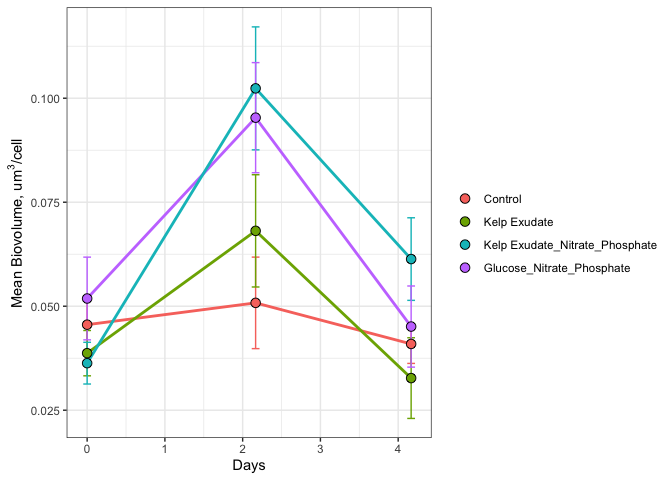<!-- -->

``` r
glimpse(cells)
```

    ## Rows: 12
    ## Columns: 25
    ## $ Experiment               <chr> "144L_2021", "144L_2021", "144L_2021", "144L_…
    ## $ Location                 <chr> "Goleta Pier", "Goleta Pier", "Goleta Pier", …
    ## $ Temperature              <dbl> 19, 19, 19, 19, 19, 19, 19, 19, 19, 19, 19, 19
    ## $ Depth                    <dbl> 1, 1, 1, 1, 1, 1, 1, 1, 1, 1, 1, 1
    ## $ Timepoint                <dbl> 0, 4, 8, 0, 4, 8, 0, 4, 8, 0, 4, 8
    ## $ Treatment                <chr> "Control", "Control", "Control", "Kelp Exudat…
    ## $ Target_DOC_Amendment     <dbl> 0, 0, 0, 10, 10, 10, 10, 10, 10, 10, 10, 10
    ## $ Inoculum_L               <dbl> 2, 2, 2, 2, 2, 2, 2, 2, 2, 2, 2, 2
    ## $ Media_L                  <dbl> 5, 5, 5, 5, 5, 5, 5, 5, 5, 5, 5, 5
    ## $ Datetime                 <dttm> 2021-10-04 16:00:00, 2021-10-06 20:00:00, 202…
    ## $ TOC_Sample               <lgl> TRUE, TRUE, TRUE, TRUE, TRUE, TRUE, TRUE, TRU…
    ## $ Cell_Sample              <lgl> TRUE, TRUE, TRUE, TRUE, TRUE, TRUE, TRUE, TRU…
    ## $ DAPI_Sample              <lgl> TRUE, TRUE, TRUE, TRUE, TRUE, TRUE, TRUE, TRU…
    ## $ DNA_Sample               <lgl> TRUE, TRUE, TRUE, TRUE, TRUE, TRUE, TRUE, TRU…
    ## $ Nutrient_Sample          <lgl> TRUE, FALSE, FALSE, TRUE, FALSE, FALSE, TRUE,…
    ## $ Cells_mL                 <dbl> 660667.0, 919405.6, 1133869.7, 663088.1, 104…
    ## $ Cells_mL_Stdev           <dbl> 73217.76, 363326.27, 99930.05, 113546.27, 181…
    ## $ Mean_Biovolume_um3_cell  <dbl> 0.04556209, 0.05080353, 0.04093212, 0.0387149…
    ## $ Biovolume_Stdev_um3_cell <dbl> 0.006054805, 0.011000369, 0.004684495, 0.0054…
    ## $ Cells_L                  <dbl> 660667000, 919405583, 1133869724, 663088109, …
    ## $ Cells_L_Stdev            <dbl> 73217756, 363326274, 99930050, 113546267, 181…
    ## $ interv                   <Interval> 2021-10-04 16:00:00 UTC--2021-10-04 16:00:00 …
    ## $ s                        <dbl> 0, 187200, 360000, 0, 187200, 360000, 0, 1872…
    ## $ hours                    <dbl> 0, 52, 100, 0, 52, 100, 0, 52, 100, 0, 52, 100
    ## $ days                     <dbl> 0.000000, 2.166667, 4.166667, 0.000000, 2.166…

Q2: What differences do you notice between the cell abundance data and
the cell biovolume data across each treatment?

A2: Across all treatments, cell biovolume decreases more drastically
after T4 than in cell abundance. Kelp exudate + NP had more biovolume
than glucose; however, glucose had more cell abundance than kelp exudate
+ NP. This means that kelp exudate + NP has a higher bacterial growth
efficency than glucose.

# Next Steps

We can calculate:

-   total change in cells from inital condition to the end of the
    experiment
-   specific growth rates as the slope of ln(abundance) v time during
    exponential growth phase
-   doubling time as ln(2) divided by the specific growth rate

1st, we’ll have to determine **where** exponential growth is occurring
in each of the bottles, if it does. To do this, we’ll plot ln(abundance)
vs time.

# Identify exponential phase of growth

**NOTE about logarithms in R**

log(x) gives the natural log of x, not log base 10 log10(x) gives the
log base 10 log2(x) gives log base 2

``` r
ln_cells <- cells %>%
  group_by(Treatment) %>%
  mutate(ln_cells = log(Cells_L),
         diff_ln_cells = ln_cells - lag(ln_cells, default = first(ln_cells))) %>%
  ungroup()
#ln_cells is a column name here, not the df
#subtracting the previous row from the one below it 
#can add/remove the default line and re-make the df to show what it does 
```

Now let’s plot our new calculated data:

``` r
ln_cells %>%
  #mutate(dna = ifelse(DNA_Sample == T, "*", NA)) %>%
  ggplot(aes(x=days, y=diff_ln_cells, group = Treatment)) +
  geom_line(aes(color = factor(Treatment, levels = levels)), size = 1) +
  geom_point(aes(fill = factor(Treatment, levels = levels)), size = 3, color = "black",shape = 21) + 
  #geom_text(aes(label = dna), size = 12, color = "#E41A1C")+
  labs(x = "Days", y = expression(paste("∆ln cells, L"^-1)), fill = "") + #delta is Option + j 
  guides(color = "none") + 
  #scale_color_manual(values = custom.colors) +
  #scale_fill_manual(values = custom.colors) +
  #we will want to see each plot by itself, so add a facet
  #facet_wrap("Bottle", nrow = 1) +
  theme_bw()
```

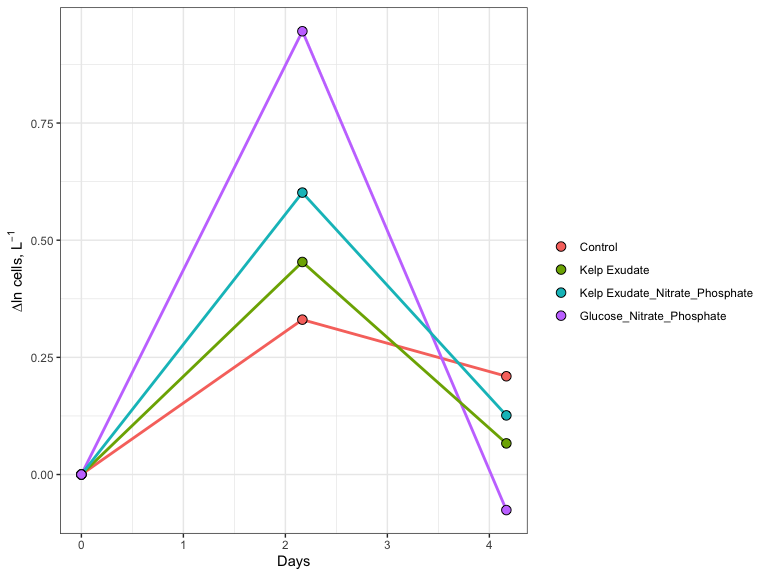<!-- -->

Q: Where is exponential growth occurring?

A: Between 0-2 days for all bottles. (T0 - T4)

Q3: What are the limitations of using the DAPI data (only 3 timepoints)
instead of the FCM data? Hint: Think about this question in terms of
bacterial growth curves, and which phase of growth we need in order to
calculate specific growth rates.

A3: The FCM data was taken every time point meaning that we would have
seen a more detailed growth curve of what the cell counts were. DAPI
data does show the exponential growth occurring between 0-2 days;
however, FCM would have given a more specified explanation of what
occured to the growth in each experiment around day 2 (ie. plateaued,
dipped, spiked).

## Calculate growth rates, doubling times, and ∆cell abundances using cell abundance data (cells/L)

``` r
growth <- ln_cells %>% 
  mutate(exp_start = 0, #create two new columns with start & end of exponential
         exp_end = 4) %>% 
  group_by(Treatment) %>% 
  mutate(ln_cells_exp_start = ifelse(Timepoint == exp_start, ln_cells, NA), 
         ln_cells_exp_end = ifelse(Timepoint == exp_end, ln_cells, NA), 
         cells_exp_start = ifelse(Timepoint == exp_start, Cells_L, NA), 
         cells_exp_end = ifelse(Timepoint == exp_end, Cells_L, NA), 
         days_exp_start = ifelse(Timepoint == exp_start, days, NA), 
         days_exp_end = ifelse(Timepoint == exp_end, days, NA), ) %>% 
  fill(ln_cells_exp_start:days_exp_end, .direction = "updown") %>% #fill values into the na's for each bottle, data is grouped so it won't fill into next treatment
  mutate(mew = (ln_cells_exp_end - ln_cells_exp_start)/(days_exp_end - days_exp_start), #calculate specific growth rate ((end - start)/timeperiod)
         doubling = log(2)/mew,
         delta_cells = cells_exp_end - first(Cells_L)) %>% 
  ungroup()

glimpse(growth)
```

    ## Rows: 12
    ## Columns: 38
    ## $ Experiment               <chr> "144L_2021", "144L_2021", "144L_2021", "144L_…
    ## $ Location                 <chr> "Goleta Pier", "Goleta Pier", "Goleta Pier", …
    ## $ Temperature              <dbl> 19, 19, 19, 19, 19, 19, 19, 19, 19, 19, 19, 19
    ## $ Depth                    <dbl> 1, 1, 1, 1, 1, 1, 1, 1, 1, 1, 1, 1
    ## $ Timepoint                <dbl> 0, 4, 8, 0, 4, 8, 0, 4, 8, 0, 4, 8
    ## $ Treatment                <chr> "Control", "Control", "Control", "Kelp Exudat…
    ## $ Target_DOC_Amendment     <dbl> 0, 0, 0, 10, 10, 10, 10, 10, 10, 10, 10, 10
    ## $ Inoculum_L               <dbl> 2, 2, 2, 2, 2, 2, 2, 2, 2, 2, 2, 2
    ## $ Media_L                  <dbl> 5, 5, 5, 5, 5, 5, 5, 5, 5, 5, 5, 5
    ## $ Datetime                 <dttm> 2021-10-04 16:00:00, 2021-10-06 20:00:00, 202…
    ## $ TOC_Sample               <lgl> TRUE, TRUE, TRUE, TRUE, TRUE, TRUE, TRUE, TRU…
    ## $ Cell_Sample              <lgl> TRUE, TRUE, TRUE, TRUE, TRUE, TRUE, TRUE, TRU…
    ## $ DAPI_Sample              <lgl> TRUE, TRUE, TRUE, TRUE, TRUE, TRUE, TRUE, TRU…
    ## $ DNA_Sample               <lgl> TRUE, TRUE, TRUE, TRUE, TRUE, TRUE, TRUE, TRU…
    ## $ Nutrient_Sample          <lgl> TRUE, FALSE, FALSE, TRUE, FALSE, FALSE, TRUE,…
    ## $ Cells_mL                 <dbl> 660667.0, 919405.6, 1133869.7, 663088.1, 104…
    ## $ Cells_mL_Stdev           <dbl> 73217.76, 363326.27, 99930.05, 113546.27, 181…
    ## $ Mean_Biovolume_um3_cell  <dbl> 0.04556209, 0.05080353, 0.04093212, 0.0387149…
    ## $ Biovolume_Stdev_um3_cell <dbl> 0.006054805, 0.011000369, 0.004684495, 0.0054…
    ## $ Cells_L                  <dbl> 660667000, 919405583, 1133869724, 663088109, …
    ## $ Cells_L_Stdev            <dbl> 73217756, 363326274, 99930050, 113546267, 181…
    ## $ interv                   <Interval> 2021-10-04 16:00:00 UTC--2021-10-04 16:00:00 …
    ## $ s                        <dbl> 0, 187200, 360000, 0, 187200, 360000, 0, 1872…
    ## $ hours                    <dbl> 0, 52, 100, 0, 52, 100, 0, 52, 100, 0, 52, 100
    ## $ days                     <dbl> 0.000000, 2.166667, 4.166667, 0.000000, 2.166…
    ## $ ln_cells                 <dbl> 20.30876, 20.63924, 20.84890, 20.31242, 20.76…
    ## $ diff_ln_cells            <dbl> 0.00000000, 0.33047743, 0.20966424, 0.0000000…
    ## $ exp_start                <dbl> 0, 0, 0, 0, 0, 0, 0, 0, 0, 0, 0, 0
    ## $ exp_end                  <dbl> 4, 4, 4, 4, 4, 4, 4, 4, 4, 4, 4, 4
    ## $ ln_cells_exp_start       <dbl> 20.30876, 20.30876, 20.30876, 20.31242, 20.31…
    ## $ ln_cells_exp_end         <dbl> 20.63924, 20.63924, 20.63924, 20.76594, …
    ## $ cells_exp_start          <dbl> 660667000, 660667000, 660667000, 663088109, 6…
    ## $ cells_exp_end            <dbl> 919405583, 919405583, 919405583, 1043597828, …
    ## $ days_exp_start           <dbl> 0, 0, 0, 0, 0, 0, 0, 0, 0, 0, 0, 0
    ## $ days_exp_end             <dbl> 2.166667, 2.166667, 2.166667, 2.166667, 2.166…
    ## $ mew                      <dbl> 0.1525280, 0.1525280, 0.1525280, 0.2093177, 0…
    ## $ doubling                 <dbl> 4.544392, 4.544392, 4.544392, 3.311461, 3.311…
    ## $ delta_cells              <dbl> 258738583, 258738583, 258738583, 380509719, 3…

``` r
#check <- growth %>%
  #select(Treatment, Timepoint, exp_start, exp_end, ln_cells, ln_cells_exp_start:days_exp_end)
```

## Convert bacterial abundance & change in bacterial abundance to carbon units

Apply a carbon conversion factor (CCF) to bacterial abundances (cells
L<sup>-1</sup>) to generate bacterial carbon (µmol C L<sup>-1</sup>)

We’ll apply the average carbon content of bacterioplankton cells from
Coastal Japan (\~30 fg C cell<sup>-1</sup>), reported by [Fukuda et al.,
1998](https://aem.asm.org/content/64/9/3352). This CCF was used in
previous experiments conducted in the SBC: [James et al.,
2017](https://journals.plos.org/plosone/article?id=10.1371/journal.pone.0173145)

We will also generate our own CCFs using the biovolume data and the
equation provided by Prof. Carlson in class:

    fg C / cell = 91.7(um^3)^0.686*2.72

And use these biovolume-derived CCFs to calculate bacterial carbon, DOC
& BGEs for comparison with the same metrics calculated using a CCF of 30
fg C / cell.

``` r
#convert the fg to umol to C/L, create our own CCF's using cell biovolume
bactcarbon <- growth %>% 
  mutate(CCF = 30, 
        bc = Cells_L * CCF * (1/12 * 10^-9), 
        delta_bc = delta_cells * CCF * (1/12 * 10^-9), 
        biovol_CCF = 91.7*(Mean_Biovolume_um3_cell)^0.686 * 2.72, 
        biovol_bc = Cells_L * biovol_CCF * (1/12 * 10^-9), 
        biovol_bc_exp_end = ifelse(Timepoint == exp_end, biovol_bc, NA), 
        delta_biovol_bc = delta_cells * CCF * (1/12 * 10^-9)) %>% 
  group_by(Treatment) %>%
  mutate(delta_biovol_bc = biovol_bc_exp_end - first(biovol_bc)) %>%
  fill(biovol_bc_exp_end:delta_biovol_bc, .direction = "updown") %>%
  ungroup()
    

glimpse(bactcarbon)
```

    ## Rows: 12
    ## Columns: 45
    ## $ Experiment               <chr> "144L_2021", "144L_2021", "144L_2021", "144L_…
    ## $ Location                 <chr> "Goleta Pier", "Goleta Pier", "Goleta Pier", …
    ## $ Temperature              <dbl> 19, 19, 19, 19, 19, 19, 19, 19, 19, 19, 19, 19
    ## $ Depth                    <dbl> 1, 1, 1, 1, 1, 1, 1, 1, 1, 1, 1, 1
    ## $ Timepoint                <dbl> 0, 4, 8, 0, 4, 8, 0, 4, 8, 0, 4, 8
    ## $ Treatment                <chr> "Control", "Control", "Control", "Kelp Exudat…
    ## $ Target_DOC_Amendment     <dbl> 0, 0, 0, 10, 10, 10, 10, 10, 10, 10, 10, 10
    ## $ Inoculum_L               <dbl> 2, 2, 2, 2, 2, 2, 2, 2, 2, 2, 2, 2
    ## $ Media_L                  <dbl> 5, 5, 5, 5, 5, 5, 5, 5, 5, 5, 5, 5
    ## $ Datetime                 <dttm> 2021-10-04 16:00:00, 2021-10-06 20:00:00, 202…
    ## $ TOC_Sample               <lgl> TRUE, TRUE, TRUE, TRUE, TRUE, TRUE, TRUE, TRU…
    ## $ Cell_Sample              <lgl> TRUE, TRUE, TRUE, TRUE, TRUE, TRUE, TRUE, TRU…
    ## $ DAPI_Sample              <lgl> TRUE, TRUE, TRUE, TRUE, TRUE, TRUE, TRUE, TRU…
    ## $ DNA_Sample               <lgl> TRUE, TRUE, TRUE, TRUE, TRUE, TRUE, TRUE, TRU…
    ## $ Nutrient_Sample          <lgl> TRUE, FALSE, FALSE, TRUE, FALSE, FALSE, TRUE,…
    ## $ Cells_mL                 <dbl> 660667.0, 919405.6, 1133869.7, 663088.1, 104…
    ## $ Cells_mL_Stdev           <dbl> 73217.76, 363326.27, 99930.05, 113546.27, 181…
    ## $ Mean_Biovolume_um3_cell  <dbl> 0.04556209, 0.05080353, 0.04093212, 0.0387149…
    ## $ Biovolume_Stdev_um3_cell <dbl> 0.006054805, 0.011000369, 0.004684495, 0.0054…
    ## $ Cells_L                  <dbl> 660667000, 919405583, 1133869724, 663088109, …
    ## $ Cells_L_Stdev            <dbl> 73217756, 363326274, 99930050, 113546267, 181…
    ## $ interv                   <Interval> 2021-10-04 16:00:00 UTC--2021-10-04 16:00:00 …
    ## $ s                        <dbl> 0, 187200, 360000, 0, 187200, 360000, 0, 1872…
    ## $ hours                    <dbl> 0, 52, 100, 0, 52, 100, 0, 52, 100, 0, 52, 100
    ## $ days                     <dbl> 0.000000, 2.166667, 4.166667, 0.000000, 2.166…
    ## $ ln_cells                 <dbl> 20.30876, 20.63924, 20.84890, 20.31242, 20.76…
    ## $ diff_ln_cells            <dbl> 0.00000000, 0.33047743, 0.20966424, 0.0000000…
    ## $ exp_start                <dbl> 0, 0, 0, 0, 0, 0, 0, 0, 0, 0, 0, 0
    ## $ exp_end                  <dbl> 4, 4, 4, 4, 4, 4, 4, 4, 4, 4, 4, 4
    ## $ ln_cells_exp_start       <dbl> 20.30876, 20.30876, 20.30876, 20.31242, 20.31…
    ## $ ln_cells_exp_end         <dbl> 20.63924, 20.63924, 20.63924, 20.76594, …
    ## $ cells_exp_start          <dbl> 660667000, 660667000, 660667000, 663088109, 6…
    ## $ cells_exp_end            <dbl> 919405583, 919405583, 919405583, 1043597828, …
    ## $ days_exp_start           <dbl> 0, 0, 0, 0, 0, 0, 0, 0, 0, 0, 0, 0
    ## $ days_exp_end             <dbl> 2.166667, 2.166667, 2.166667, 2.166667, 2.166…
    ## $ mew                      <dbl> 0.1525280, 0.1525280, 0.1525280, 0.2093177, 0…
    ## $ doubling                 <dbl> 4.544392, 4.544392, 4.544392, 3.311461, 3.311…
    ## $ delta_cells              <dbl> 258738583, 258738583, 258738583, 380509719, 3…
    ## $ CCF                      <dbl> 30, 30, 30, 30, 30, 30, 30, 30, 30, 30, 30, 30
    ## $ bc                       <dbl> 1.651667, 2.298514, 2.834674, 1.657720, 2.608…
    ## $ delta_bc                 <dbl> 0.6468465, 0.6468465, 0.6468465, 0.9512743, 0…
    ## $ biovol_CCF               <dbl> 29.97370, 32.29843, 27.84930, 26.80546, 39.49…
    ## $ biovol_bc                <dbl> 1.650220, 2.474613, 2.631457, 1.481199, 3.434…
    ## $ biovol_bc_exp_end        <dbl> 2.474613, 2.474613, 2.474613, 3.434791, 3.434…
    ## $ delta_biovol_bc          <dbl> 0.8243938, 0.8243938, 0.8243938, 1.9535926, 1…

``` r
#update this filepath to match your own repository 
#save your data to a .csv 
write.csv(bactcarbon, "~/144l_students_2021/Output_Data/week6/211101_dapi_data_calculations.csv")

#normally we would do this for the individual bottles and then calculate averages, but can't do that here since we have data from combined bottles 
```

# Plot

``` r
trt_ba <- bactcarbon %>% 
  ggplot(aes(x = days, y = bc), group = Treatment) +
  #geom_errorbar(aes(ymin = ave_bc - sd_bc, ymax = ave_bc + sd_bc, color = factor(Treatment, levels = levels)), width = 0.1) +
  geom_line(aes(color = factor(Treatment, levels = levels)), size = 1) +
  geom_point(aes(fill = factor(Treatment, levels = levels)), color = "black", shape = 21, size = 3) +
  labs(x = "Days", y = expression("Bacterial Carbon, µmol C L"^-1), fill = "", color = "") +
  guides(scale = "none") +
  theme_bw()

trt_ba
```

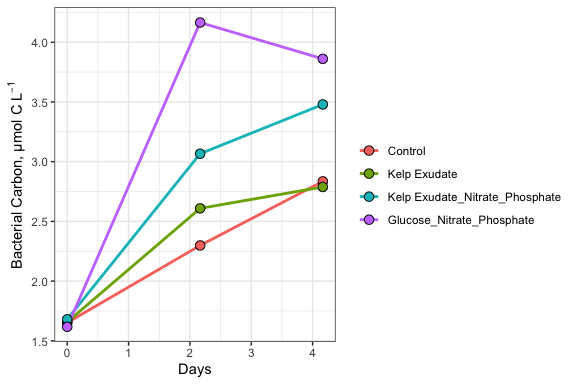<!-- -->

``` r
saveRDS(trt_ba, "~/144l_students_2021/Output_Data/week6/144L_trt_ba_plot.rds")
```

``` r
trt_ba_biovol <- bactcarbon %>% 
  ggplot(aes(x = days, y = biovol_bc), group = Treatment) +
  #geom_errorbar(aes(ymin = ave_bc - sd_bc, ymax = ave_bc + sd_bc, color = factor(Treatment, levels = levels)), width = 0.1) +
  geom_line(aes(color = factor(Treatment, levels = levels)), size = 1) +
  geom_point(aes(fill = factor(Treatment, levels = levels)), color = "black", shape = 21, size = 3) +
  labs(x = "Days", y = expression("Biovolume-Derived Bacterial Carbon, µmol C L"^-1), fill = "", color = "") +
  guides(scale = "none") +
  theme_bw()

trt_ba_biovol
```

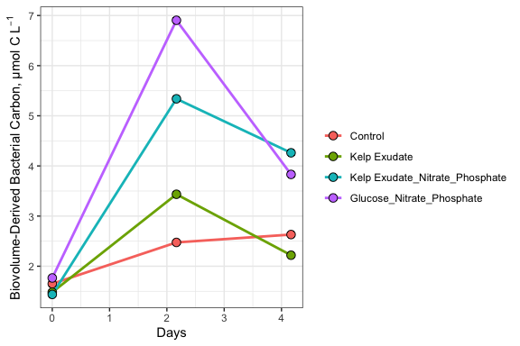<!-- -->

``` r
saveRDS(trt_ba_biovol, "~/144l_students_2021/Output_Data/week6/144L_trt_ba_biovol_plot.rds")
```

Q4: How do the bacterial carbon values change when we account for
changes in cell biovolume as the experiment progresses?

A4: Bacterial carbon values show a steeper decline after T4 (or day 2)
when we account for biovolume because we see the cells in terms of size.

## Barplots

``` r
bar.data <- bactcarbon %>% 
  select(Treatment, mew, doubling, delta_cells) %>%
  unique()
```

``` r
mew <- bar.data %>% 
  ggplot(aes(x = factor(Treatment, levels = levels), y = mew), group = Treatment) +
  geom_col(color = "black", fill = "white") +
  #geom_errorbar(aes(ymin = ave_mew - sd_mew, ymax = ave_mew + sd_mew), width = 0.1) +
  labs(x = "", y = expression("µ, d"^-1)) +
  guides(scale = "none")+
  coord_flip()+
  theme_bw()

mew 
```

<!-- -->

``` r
#store each plot as an object
```

``` r
doubling <- bar.data %>% 
  ggplot(aes(x = factor(Treatment, levels = levels), y = doubling), group = Treatment) +
  geom_col(color = "black", fill = "white") +
  #geom_errorbar(aes(ymin = ave_doubling - sd_doubling, ymax = ave_doubling + sd_doubling), width = 0.1) +
  labs(x = "", y = expression("Doubling Time, d")) +
  coord_flip()+
  theme_bw()

doubling
```

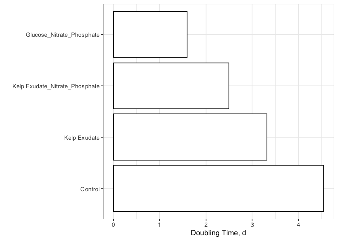<!-- -->

``` r
delta_cells <- bar.data %>% 
  ggplot(aes(x = factor(Treatment, levels = levels), y = delta_cells), group = Treatment) +
  geom_col(color = "black", fill = "white") +
  #geom_errorbar(aes(ymin = ave_delta_bc - sd_delta_bc, ymax = ave_delta_bc + sd_delta_bc), width = 0.1) +
  labs(x = "", y = expression("∆ Cells, L"^-1)) +
  coord_flip() +
  theme_bw()
delta_cells
```

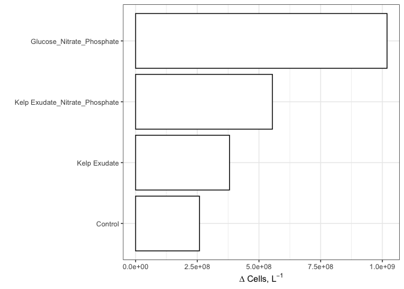<!-- -->

``` r
#uncomment the next line below if you need to install the package "patchwork" (remove the #)
# install.packages("patchwork")
library(patchwork)
```

``` r
#we can add our plots together to make a nice composite figure

delta_cells + mew + doubling + plot_annotation(tag_levels = "a") +plot_layout(ncol =1)
```

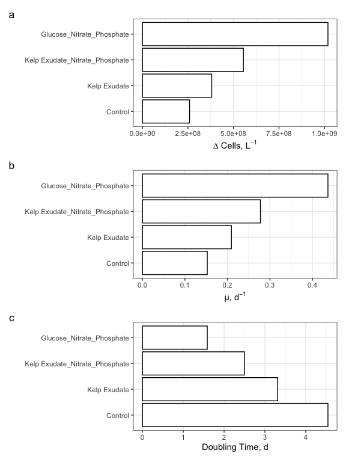<!-- -->

Q5: Do the patterns you see in the ∆Cells, specific growth rate (u), and
doubling time line up with our previous observations of cell abundance?
How about with the oxygen drawdown data?

A5: The patterns in ∆Cells and growth rate are very similar as they
increase the same way that cell abundacne did in its growth phase.
Oxygen coincides with these graphs because oxygen will decrease as the
∆cells increases and growth rate. Doubling time is the inverse of these
graphs and this too matches with out previous observations of cell
abundance.The treatments that excelled with growth rate and abundance
did not double as quickly as they used up more resources and oxygen.

# Save Data

``` r
saveRDS(bactcarbon, "~/144l_students_2021/Output_Data/week6/144L_Exp_Processed_BactAbund.rds")
```

# Incorporate TOC data

``` r
toc <- left_join(bactcarbon, toc_data)
```

    ## Joining, by = c("Timepoint", "Treatment")

``` r
glimpse(toc)
```

    ## Rows: 12
    ## Columns: 47
    ## $ Experiment               <chr> "144L_2021", "144L_2021", "144L_2021", "144L_…
    ## $ Location                 <chr> "Goleta Pier", "Goleta Pier", "Goleta Pier", …
    ## $ Temperature              <dbl> 19, 19, 19, 19, 19, 19, 19, 19, 19, 19, 19, 19
    ## $ Depth                    <dbl> 1, 1, 1, 1, 1, 1, 1, 1, 1, 1, 1, 1
    ## $ Timepoint                <dbl> 0, 4, 8, 0, 4, 8, 0, 4, 8, 0, 4, 8
    ## $ Treatment                <chr> "Control", "Control", "Control", "Kelp Exudat…
    ## $ Target_DOC_Amendment     <dbl> 0, 0, 0, 10, 10, 10, 10, 10, 10, 10, 10, 10
    ## $ Inoculum_L               <dbl> 2, 2, 2, 2, 2, 2, 2, 2, 2, 2, 2, 2
    ## $ Media_L                  <dbl> 5, 5, 5, 5, 5, 5, 5, 5, 5, 5, 5, 5
    ## $ Datetime                 <dttm> 2021-10-04 16:00:00, 2021-10-06 20:00:00, 202…
    ## $ TOC_Sample               <lgl> TRUE, TRUE, TRUE, TRUE, TRUE, TRUE, TRUE, TRU…
    ## $ Cell_Sample              <lgl> TRUE, TRUE, TRUE, TRUE, TRUE, TRUE, TRUE, TRU…
    ## $ DAPI_Sample              <lgl> TRUE, TRUE, TRUE, TRUE, TRUE, TRUE, TRUE, TRU…
    ## $ DNA_Sample               <lgl> TRUE, TRUE, TRUE, TRUE, TRUE, TRUE, TRUE, TRU…
    ## $ Nutrient_Sample          <lgl> TRUE, FALSE, FALSE, TRUE, FALSE, FALSE, TRUE,…
    ## $ Cells_mL                 <dbl> 660667.0, 919405.6, 1133869.7, 663088.1, 104…
    ## $ Cells_mL_Stdev           <dbl> 73217.76, 363326.27, 99930.05, 113546.27, 181…
    ## $ Mean_Biovolume_um3_cell  <dbl> 0.04556209, 0.05080353, 0.04093212, 0.0387149…
    ## $ Biovolume_Stdev_um3_cell <dbl> 0.006054805, 0.011000369, 0.004684495, 0.0054…
    ## $ Cells_L                  <dbl> 660667000, 919405583, 1133869724, 663088109, …
    ## $ Cells_L_Stdev            <dbl> 73217756, 363326274, 99930050, 113546267, 181…
    ## $ interv                   <Interval> 2021-10-04 16:00:00 UTC--2021-10-04 16:00:00 …
    ## $ s                        <dbl> 0, 187200, 360000, 0, 187200, 360000, 0, 1872…
    ## $ hours                    <dbl> 0, 52, 100, 0, 52, 100, 0, 52, 100, 0, 52, 100
    ## $ days                     <dbl> 0.000000, 2.166667, 4.166667, 0.000000, 2.166…
    ## $ ln_cells                 <dbl> 20.30876, 20.63924, 20.84890, 20.31242, 20.76…
    ## $ diff_ln_cells            <dbl> 0.00000000, 0.33047743, 0.20966424, 0.0000000…
    ## $ exp_start                <dbl> 0, 0, 0, 0, 0, 0, 0, 0, 0, 0, 0, 0
    ## $ exp_end                  <dbl> 4, 4, 4, 4, 4, 4, 4, 4, 4, 4, 4, 4
    ## $ ln_cells_exp_start       <dbl> 20.30876, 20.30876, 20.30876, 20.31242, 20.31…
    ## $ ln_cells_exp_end         <dbl> 20.63924, 20.63924, 20.63924, 20.76594, …
    ## $ cells_exp_start          <dbl> 660667000, 660667000, 660667000, 663088109, 6…
    ## $ cells_exp_end            <dbl> 919405583, 919405583, 919405583, 1043597828, …
    ## $ days_exp_start           <dbl> 0, 0, 0, 0, 0, 0, 0, 0, 0, 0, 0, 0
    ## $ days_exp_end             <dbl> 2.166667, 2.166667, 2.166667, 2.166667, 2.166…
    ## $ mew                      <dbl> 0.1525280, 0.1525280, 0.1525280, 0.2093177, 0…
    ## $ doubling                 <dbl> 4.544392, 4.544392, 4.544392, 3.311461, 3.311…
    ## $ delta_cells              <dbl> 258738583, 258738583, 258738583, 380509719, 3…
    ## $ CCF                      <dbl> 30, 30, 30, 30, 30, 30, 30, 30, 30, 30, 30, 30
    ## $ bc                       <dbl> 1.651667, 2.298514, 2.834674, 1.657720, 2.608…
    ## $ delta_bc                 <dbl> 0.6468465, 0.6468465, 0.6468465, 0.9512743, 0…
    ## $ biovol_CCF               <dbl> 29.97370, 32.29843, 27.84930, 26.80546, 39.49…
    ## $ biovol_bc                <dbl> 1.650220, 2.474613, 2.631457, 1.481199, 3.434…
    ## $ biovol_bc_exp_end        <dbl> 2.474613, 2.474613, 2.474613, 3.434791, 3.434…
    ## $ delta_biovol_bc          <dbl> 0.8243938, 0.8243938, 0.8243938, 1.9535926, 1…
    ## $ Mean_uMC                 <dbl> 91.70646, 89.13506, 87.79890, 94.82839, 89.17…
    ## $ Stdev_uMC                <dbl> 0.2829882, 0.1920780, 0.2928296, 0.3088847, 0…

``` r
toc %>% 
  ggplot(aes(x = days, y = Mean_uMC, group = Treatment) ) + 
  geom_errorbar(aes(ymin = Mean_uMC - Stdev_uMC, ymax = Mean_uMC + Stdev_uMC, color = factor(Treatment, levels = levels)), width = 0.4) +
  geom_point(aes(fill = factor(Treatment, levels = levels)), size = 3, shape = 21, alpha = 0.7 ) +
  geom_line(aes(color = factor(Treatment, levels = levels)), size = 1, alpha = 0.7 ) +
  #scale_color_manual(values = custom.colors) +
  #scale_fill_manual(values = custom.colors) +
  labs(x = "Days", y = expression(paste("Total Organic Carbon, µmol C L"^-1))) +
  theme_classic() +
  #comment out the facet_wrap if you want to view all the treatments on top of eachother 
  facet_wrap(~factor(Treatment, levels = levels), nrow=1) +
  theme(legend.title = element_blank()) +
  guides(scale = "none")
```

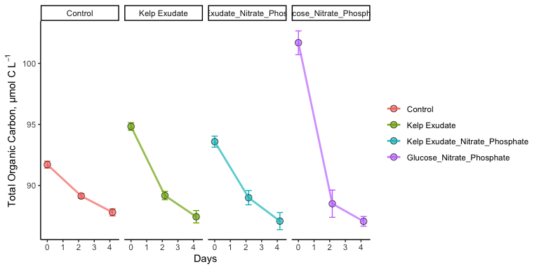<!-- -->

Q6: a) What was our target concentration of carbon to add to each
treatment? b) Did we hit our target in each treatment? c) What does this
imply about our ability to assess the effect of the **type** of DOC
added? d) What happens to TOC over time in the incubations and does this
align with our other data?

A6: a) 10 umol C L-1 b) We nearly hit the target in the glucose
treatment but did not for the kelp exudate or kelp exudate + NP. c) We
would question if the amount of glucose carbon added influences that
treatment’s ability to operate in this experiment over other treatments.
However, due to the other results we can determine that the difference
in concentration of carbon added in the beginning to each treatment is
negligible.  
d) The TOC is used up and so is oxygen which coincide with building of
biomass in the cells and cell abundance. We also see an increase of
respiration meaning more CO2 is being produced.

## Calculate DOC, ∆DOC, Bioavailable DOC Fraction, and Bacterial Growth Efficiency (BGE)

``` r
doc <- toc %>% 
  mutate(doc = Mean_uMC - bc, 
         doc_bv = Mean_uMC - biovol_bc) %>% 
  group_by(Treatment) %>%
  mutate(doc_exp_end = ifelse(Timepoint == exp_end, doc, NA),
         bioav_doc = (first(doc) - doc_exp_end) / first(doc),
         delta_doc = first(doc) - doc_exp_end,
         bge = ifelse(delta_doc > 1.5, delta_bc/delta_doc, NA), 
         doc_bv_exp_end = ifelse(Timepoint == exp_end, doc_bv, NA),
         bioav_doc_bv = (first(doc_bv) - doc_bv_exp_end) / first(doc_bv),
         delta_doc_bv = first(doc_bv) - doc_bv_exp_end,
         bge_bv = ifelse(delta_doc_bv > 1.5, delta_biovol_bc/delta_doc_bv, NA)) %>% 
  fill(doc_exp_end:bge_bv, .direction = "downup") %>% 
  ungroup()
```

``` r
bioav <- doc %>% 
ggplot(aes(x = factor(Treatment, levels = levels), y =  bioav_doc, group =Treatment))  + 
  geom_bar(position = position_dodge(), stat = "identity", color = "black", fill = "white", alpha = 1) +
  #geom_errorbar(aes(ymin = ave_bioav_doc - sd_bioav_doc, ymax = ave_bioav_doc + sd_bioav_doc), position = position_dodge(width = 0.9), stat = "identity", width = 0.1, size = 0.5) +
  labs(x = "", y = expression(paste("Bioavailable DOC Fraction")), color = "") +
  theme_classic() +
  coord_flip()+
  #facet_grid(~factor(Location, levels = levels), scales = "free") +
  guides(scale = "none") 

bioav
```

<!-- -->

``` r
bioav_bv <- doc %>% 
ggplot(aes(x = factor(Treatment, levels = levels), y =  bioav_doc_bv, group =Treatment))  + 
  geom_bar(position = position_dodge(), stat = "identity", color = "black", fill = "white", alpha = 1) +
  #geom_errorbar(aes(ymin = ave_bioav_doc - sd_bioav_doc, ymax = ave_bioav_doc + sd_bioav_doc), position = position_dodge(width = 0.9), stat = "identity", width = 0.1, size = 0.5) +
  labs(x = "", y = expression(paste("Biovolume-Derived Bioavailable DOC Fraction")), color = "") +
  theme_classic() +
  coord_flip()+
  #facet_grid(~factor(Location, levels = levels), scales = "free") +
  guides(scale = "none") 

bioav_bv
```

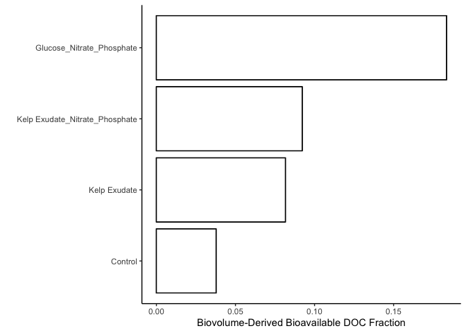<!-- -->

``` r
deldoc <- doc %>% 
ggplot(aes(x = factor(Treatment, levels = levels), y =  delta_doc, group =Treatment))  + 
  geom_bar(position = position_dodge(), stat = "identity", color = "black", fill = "white", alpha = 1) +
  #geom_errorbar(aes(ymin = ave_delta_doc - sd_delta_doc, ymax = ave_delta_doc + sd_delta_doc), position = position_dodge(width = 0.9), stat = "identity", width = 0.1, size = 0.5) +
  labs(x = "", y = expression(paste("∆ DOC, µmol C L"^-1)), color = "") +
  theme_classic() +
  coord_flip()+
  #facet_grid(~factor(Location, levels = levels), scales = "free") +
  guides(scale = "none") 
deldoc
```

<!-- -->

``` r
deldoc_bv <- doc %>% 
ggplot(aes(x = factor(Treatment, levels = levels), y =  delta_doc_bv, group =Treatment))  + 
  geom_bar(position = position_dodge(), stat = "identity", color = "black", fill = "white", alpha = 1) +
  #geom_errorbar(aes(ymin = ave_delta_doc - sd_delta_doc, ymax = ave_delta_doc + sd_delta_doc), position = position_dodge(width = 0.9), stat = "identity", width = 0.1, size = 0.5) +
  labs(x = "", y = expression(paste("Biovolume-Derived ∆ DOC, µmol C L"^-1)), color = "") +
  theme_classic() +
  coord_flip()+
  #facet_grid(~factor(Location, levels = levels), scales = "free") +
  guides(scale = "none") 
deldoc_bv
```

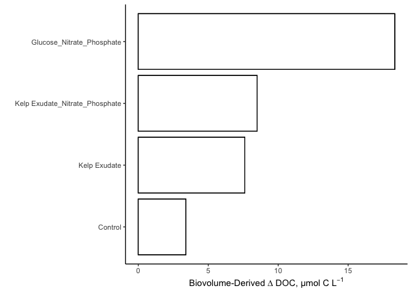<!-- -->

``` r
bge <- doc %>% 
ggplot(aes(x = factor(Treatment, levels = levels), y =  bge, group =Treatment))  + 
  geom_bar(position = position_dodge(), stat = "identity", color = "black", fill = "white", alpha = 1) +
  #geom_errorbar(aes(ymin = ave_bge - sd_bge, ymax = ave_bge + sd_bge), position = position_dodge(width = 0.9), stat = "identity", width = 0.1, size = 0.5) +
  labs(x = "", y = expression(paste("Bacterial Growth Efficiency")), color = "") +
  theme_classic() +
  coord_flip()+
  #facet_grid(~factor(Location, levels = levels), scales = "free") +
   guides(scale = "none") 
bge
```

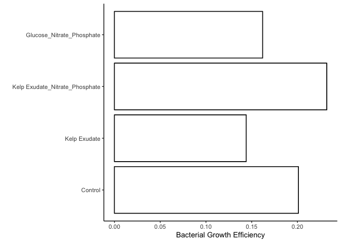<!-- -->

``` r
bge_bv <- doc %>% 
ggplot(aes(x = factor(Treatment, levels = levels), y =  bge_bv, group =Treatment))  + 
  geom_bar(position = position_dodge(), stat = "identity", color = "black", fill = "white", alpha = 1) +
  #geom_errorbar(aes(ymin = ave_bge - sd_bge, ymax = ave_bge + sd_bge), position = position_dodge(width = 0.9), stat = "identity", width = 0.1, size = 0.5) +
  labs(x = "", y = expression(paste("Biovolume-Derived Bacterial Growth Efficiency")), color = "") +
  theme_classic() +
  coord_flip()+
  #facet_grid(~factor(Location, levels = levels), scales = "free") +
  guides(scale = "none") 
bge_bv
```

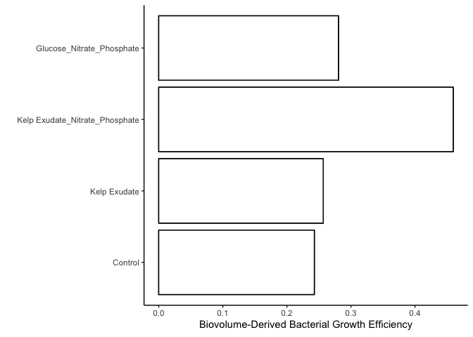<!-- -->

``` r
deldoc / deldoc_bv / bioav / bioav_bv / bge / bge_bv + plot_annotation(tag_levels = "a") + plot_layout(ncol = 2)
```

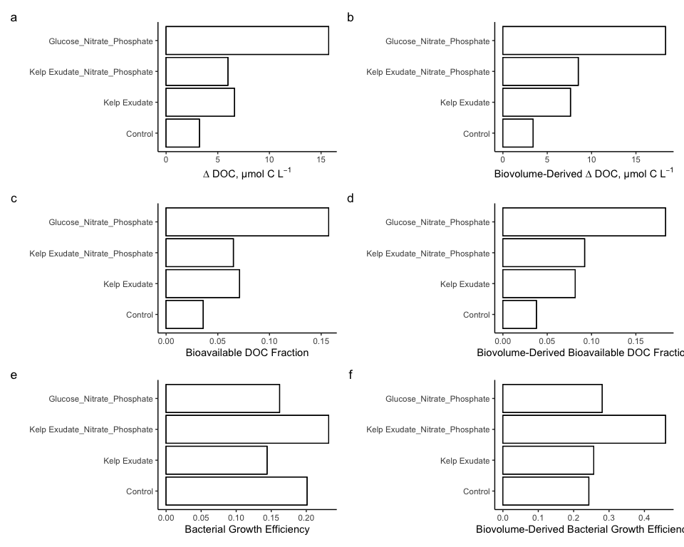<!-- -->
Q7: How does incorporating biovolume change (or not change) your
interpretation of the ∆DOC, Bioavaliable DOC, and BGE values? Provide
1-2 sentences for each comparison (a vs. b,c vs. d & e vs. f)

A7: Incorporating biovolum may not seem to have a drastic change on data
but it changes the interactions of the data. When looking at ∆DOC and
bioavailable DOC we see kelp exudate is higher than kelp exudate + NP.
However, when we incorporate biovolume we see this inversed. This is
because kelp exudate + NP has a higher biovolume than kelp exudate,
meaning the cells are larger by volume so the DOC used up differs. When
looking at Bacterial Growth Efficiency we see that the values double
when we interpret with biovolume.Control does not increase by much as it
does not have much bacterial growth. However, kelp exudate + NP is the
largest in BGE, despite Glucose having had the highest ∆Cells, ∆DOC,
etc. This is because Glucose has higher ∆DOC than it does ∆cell carbon;
kelp exudate+NP has a higher ∆cell carbon than ∆DOC.
